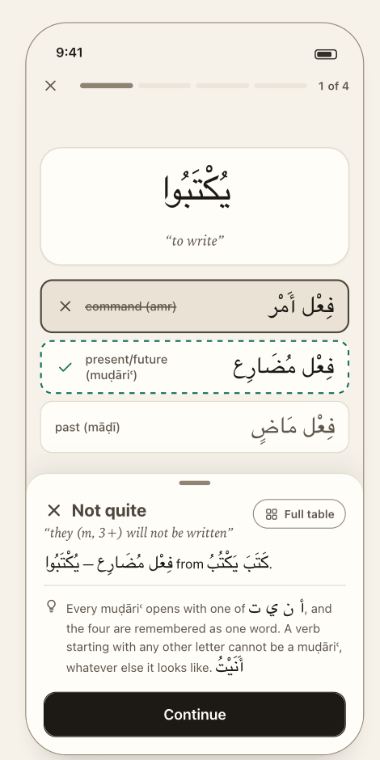
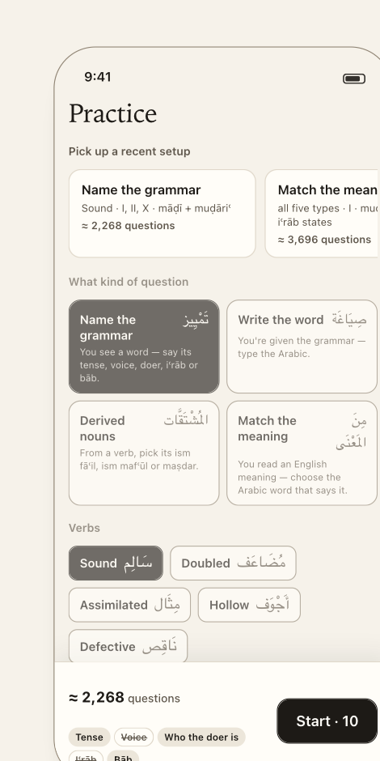
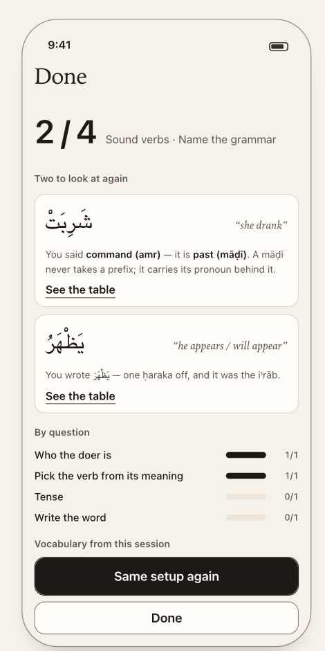

# Overview

## The app in one paragraph

**Sarf Quiz** (working title; final name TBD — check App Store availability) teaches you to *read the signs on
Arabic words*. It shows a fully vowelled word and trains you to extract everything it encodes — tense, voice,
who the doer is, iʿrāb — through short drills, and lets you look up the complete conjugation of any verb
offline. It is an iPhone app for **students of ṣarf** (madrasa and university Arabic students, serious
self-learners) who already read vowelled script and want the *patterns* to become automatic. A session is about
five minutes. **It is free and unlimited; nothing nags mid-quiz.** 🔒 D-01

## What a user does — four verbs

| Verb | Where | Meaning |
|---|---|---|
| **Drill** | Home | One tap into a ready-made session (**five words, five parse cards** — D-80). *(Later: straight into the question kind you are weakest at — Q-04.)* |
| **Configure** | Practice | Describe a pool of words — quiz type, verb types, forms, charts — see what that setup will ask, choose a length, go. |
| **Look up** | Tables | Find any verb and read its full conjugation, all forms, offline. |
| **Review** | Results (after a quiz) | The two or three words you missed, what you said, why it was wrong — then straight back in. |

Plus **More** (settings, delete history). The quiz itself is not a place you navigate to; it is what Drill and Configure *produce*.

## v1 scope

| **In v1** | **Behind a flag, off** (see [`reference/later-versions.md`](reference/later-versions.md)) |
|---|---|
| Four quiz types, fixed-length and endless | AI Explain — rule-based **tips** fill its slot instead (D-05) |
| Home drills + full Practice configuration | Detailed stats screens, history browser, weak-spot drills |
| Question relevance ("this setup asks…") | Compare — two charts side by side (dev-only, D-06) |
| Tables browser, searchable, offline | Subscription, paywall, iCloud sync — **no Pro tier at all** |
| Results with misses, breakdown, vocabulary | Mahmūz and lafīf verbs (content authored, engine not) |
| Recognition tips on wrong answers | iPad |
| Basic stats on Home (streak, week, accuracy, weakest kind) | |
| **Full history stored invisibly** for every user | |
| **Five verb types**: sālim, muḍāʿaf, mithāl, ajwaf, nāqiṣ — 135 roots | |

🔒 D-01 D-02 D-04 · Every flag is one row in a single `Settings` object with two audiences — `dev` levers and `user`
preferences (D-03). Flags gate **screens and content, never storage** (D-51).

**How success is judged.** Recorded in the old spec, never confirmed: **activation** (% of installs completing a quiz on day 1) · **retention** (D7 return; quizzes per user per week) · **quality** (average score trend — are users actually learning?) · later, **conversion** (free→trial, trial→paid).
v1 has no analytics, no accounts and a privacy label of *"Data not collected"*, so none of the in-app measures can be read — only App Store Connect's own numbers are visible (**Q-18**).

---

## Navigation and flows

*Four tabs* (🔒 D-08) *plus a full-screen quiz cover* (🎨 D-09).

```
                ┌───────────────────── TabView · system tab bar ─────────────────────┐
                │    Home            Practice           Tables            More       │
                └──────┬───────────────┬──────────────────┬────────────────┬─────────┘
                       │               │                  │                └ settings · delete history · about
   Start (hero/list) ──┤               │                  └ search ─▶ word bar ─▶ form · tense · voice · iʿrāb
   Drill it (later) ───┤               │                              ─▶ View the table ─▶ 14 rows
                       ▼               ▼
              ┌──────────────────────────────────────────────────────────┐
              │  QUIZ — full-screen cover · no tab bar                   │
              │                                                          │
              │  question ──answer──▶ graded + answer sheet rises        │
              │                          │  Full table ─▶ PEEK grid ─┐   │
              │                          │  ◀───── Back to the question ─┘
              │                          └ Continue ─▶ next question …   │
              │  last question, or End (endless) ─▶ RESULTS              │
              └────────────────────────────┬─────────────────────────────┘
                                           │ Done ──────────────▶ back to the tab you came from
                                           │ Same setup again ──▶ a new QUIZ, fresh draw
                                           │ Drill these again ─▶ a new QUIZ, the missed questions verbatim
```

**Flow 1 — first run.** Home ("No drills yet", hero = *Sound verbs*) → Start → Quiz (5 words) → Results → Done → Home
(the stats strip now has numbers).

**Flow 2 — the answer loop.** Read the card → answer (one tap / tick-and-Check / type-and-Check) → the sheet rises with
verdict, explanation and up to two tips while the word stays on screen → optionally *Full table* (peek) → Continue.

**Flow 3 — configure.** Practice → pick what kind of question → verb type → form → tense / iʿrāb / voice → watch the
pinned bar say what that asks and how many → choose a length → Start.

**Flow 4 — look something up.** Tables → search → pick a verb → its forms appear as chips → pick tense / voice / iʿrāb →
*View the table*.

**Flow 5 — act on a weakness.** *(Deferred, Q-04 — in v1 the row is display-only.)* Home → *Weakest question · Iʿrāb · 58% of 40 answers · Drill it* → Quiz → Results.

**Flow 6 — quit.** ✕ in the quiz → confirm (only if you have answered something) → the session **ends and is kept** →
back to where you started.

---

## Screen map

<table>
<tr>
<td align="center"><br><sub><b>Home</b><br><a href="screens/01-home.md">screens/01-home</a></sub></td>
<td align="center"><br><sub><b>Quiz</b><br><a href="screens/02-quiz.md">screens/02-quiz</a></sub></td>
<td align="center"><br><sub><b>Practice</b><br><a href="screens/03-practice.md">screens/03-practice</a></sub></td>
<td align="center"><br><sub><b>Tables</b><br><a href="screens/04-tables.md">screens/04-tables</a></sub></td>
<td align="center"><br><sub><b>Results</b><br><a href="screens/05-results.md">screens/05-results</a></sub></td>
</tr>
</table>

| Screen | Presented as | Screenshots | Designed? |
|---|---|---|---|
| Home | tab | 01, 15 | ✅ |
| Practice | tab | 09, 10, 18 | ✅ |
| Tables (search · pickers · table) | tab | 11, 12, 13, 17 | ✅ |
| **More** | tab | — | ❌ no design (Q-09) |
| Quiz — question, graded, peek | full-screen cover | 02–08, 16 | ✅ |
| Results | inside the quiz cover | 14 | ✅ |

All screens exist in **Paper** (light, default) and **Night**; night screenshots are 15, 16, 17, 18.

---

## The objects every screen touches

```
Plan  ──▶  Pool  ──▶  Run  ──▶  Question  ──▶  Answer
what to    every word   one live   what is      what you did — and this
draw from  the plan     session    asked        IS the history row
           admits
```

| Object | Product meaning | Created by | Read by |
|---|---|---|---|
| **Plan** | A *pool of words*, not a list of questions: quiz type, verb types, forms, tenses, voices, iʿrāb states, length. One plan serves all four quiz types. | Practice (from its chips), Home (from a preset), Results/Home (from a stored session) | Pool, history |
| **Pool** | Every word the plan admits, resolved once. Tells us how many questions exist and which properties actually *vary* — which is how dead questions are found. | the plan | Practice's bar, the quiz |
| **Run** | One live session: which question you are on, what you answered. | Start | Quiz, Results |
| **Question** | Four parts: what kind, what word, what the card shows, how you answer + what counts as correct. For `identify` it is **one question with five axes** (D-72), not five questions. | the pool | Quiz, Results, history |
| **Answer** | The question **embedded whole**, what you gave, what was expected, correct or not. A parse answer also carries **`parts[]`, one per axis** (D-77). Written to history the instant it is given, **as one row per axis** (D-78). | grading | Results, Home stats, later screens |

Depth: `docs/ARCHITECTURE.md` §2–3. **No screen decides whether an answer is right** — grading has one owner.

## Principles that shape every screen

1. **The word is the page.** The Arabic under study is the largest thing on screen; nothing decorative around it. 🎨
2. **Red appears after the answer, and only on letters that carry the grammar.** Correctness never uses red: right and
   wrong live on the option's fill, border, mark and word. *Letters carry grammar, containers carry correctness.* 🎨 D-63
3. **Never hide what exists, never advertise what doesn't.** A verb has seven forms → seven chips, gaps visible. A feature that is
   off has no chevron, no chip, no "coming soon" row — one honest sentence at most. 🎨
4. **Absence is a value.** "No drills yet", never "0%". A missing fact is left visibly missing, never replaced by a
   plausible default. 🔒 (project rule)
5. **Guessing is part of the drill.** No skip button (D-10). No streak animation, no confetti — a study session, not a
   game show. 🎨 D-65
6. **Labels are grammar, not ids.** "Who the doer can be", never `doer`. 🎨
7. **Native first.** Tab bar, lists, sheets, search, segmented controls are the platform's. Custom only where the domain is:
   prompt card, options, paradigm grid, root tiles, chart scope. 🎨
8. **Views never compute a domain fact.** Whether an answer is right, whether a chart exists, which questions are worth
   asking — the screens ask, they never decide. 🔒 (`CLAUDE.md`)

---

## What the design requires that the prototype does not do yet

The design is ahead of `web-prototype/` in these places. Each is a change to make in the app (and ideally in the
prototype first, per D-07 — that is the implementation plan's call).

| Change | Layer | Source |
|---|---|---|
| **`identify` is one parse card per word** — form, tense, iʿrāb, voice, doer answered together behind one **Check**; the `bab` kind and the `citation` prompt are deleted | quiz | 🔒 D-72, D-76 |
| A **`form` axis**, and a **`mabnī — no iʿrāb`** option on the iʿrāb row | quiz | 🔒 D-73, D-75 |
| The **draw satisfies every live axis at once** — an axis that is live is never missing from a card | quiz | 🔒 D-74 |
| `Answer.parts[]`, and a history index that **fans one answer out into one row per axis** | quiz + history | 🔒 D-77, D-78 |
| Each axis / kind **declares** its interaction: `select: 'one' \| 'many'`. Doer, voice **and iʿrāb** are always checklists. | quiz | D-60, D-70, D-74 |
| A prompt carries `ask` **and** a separate `hint` ("Select all that apply.") | quiz | design 03 §2, README |
| Wrap every Arabic run in feedback in a bidi isolate (FSI…PDI) | view | D-62 |
| "Drill these again": a run whose source is a fixed list of stored questions, and a new session mode | quiz | D-50 |
| Weakest question kind: accuracy per `category`, with a ≈20-answer floor *(display only — the plan per kind is deferred, Q-04)*. **Unchanged by D-72** — D-78's per-axis rows are what keep it working | history | 🎨 D-48 |
| Home hero = plan of the last session (Q-05) | history | 🎨 D-47 |
| **Answers persist the moment they are given**, not at session end | history | D-51 |
| Form chips need each form's **wazn** per root (Form I varies by bāb) | engine API | 🎨 D-46 — export `waznRoot()` before the API freezes |
| Prefix / stem / suffix segments of a word | engine | D-61 — **documented, not built**; only needed for post-v1 affix colouring |

## Prototype behaviour **not** to port

| Prototype does | Spec says |
|---|---|
| Appends feedback below the options; the word scrolls away | Docks as a bottom inset (D-64) |
| Doer and voice are checklists only when the draw has >1 answer (the doer ask *always* says "Select all that apply") | Always checklists (D-60, D-70); and **every ambiguous axis** is, by D-74 |
| `identify` asks one property at a time, drawing a fresh word for each | **One parse card per word** — form, tense, iʿrāb, voice, doer at once (D-72) |
| The bāb question, on a `citation` prompt | **Dropped** (D-76); the bāb lives in the sheet's explanation |
| A drill is a bundle: one word carrying its first three live kinds, "Word 2 of 5" | Five words, five questions; no tag (D-80) |
| "See the full table" exits the quiz **and loses the answers** | Peek over the quiz; answers persist per answer (D-45, D-51) |
| Prints `doer`, `tense` ids on the card and in Results | Grammar labels (principle 6) |
| The iʿrāb question draws its own muḍāriʿ, so it only appears on muḍāriʿ words | The iʿrāb row is always shown when live, with a `mabnī` option (D-75) |
| One mixed bidi run: `شَرِبَتْ — فِعْل مَاضٍ from …` reorders | Isolate every Arabic run (D-62) |
| Home: three equal Start cards, accuracy ring, 🔥 | Hero + list + strip; no flame, no ring (D-47) |
| Results: explanation sentences under a score ring | Misses first, as cards (D-49) |
| Tables: lists mahmūz/lafīf roots that then have no chart; shows only 8 results; "View table" is a navigation push | Playable verbs only (Q-12); scrolling list; table stays on the screen (D-46) |
| Practice: seven chip rows, consequences at the bottom; "content coming" chips | Pinned bar; one sentence (D-38, D-41) |
| Streak counted by **UTC** date | Local calendar day (Q-16) |
| `alert("No questions possible")` | Unreachable: Start is disabled at zero |
| Weak-verbs copy says "doubly-weak" | Dropped — lafīf is off (design 07) |

## Not designed yet

The design system covers five screens. These need a design pass; each has a default in [`OPEN_QUESTIONS.md`](OPEN_QUESTIONS.md).

| Missing | Default | |
|---|---|---|
| **More / Settings** screen | Inset-grouped list per `06-more.md` | Q-09 |
| First-run experience | None — Home's "No drills yet" *is* the first run | Q-10 |
| Arabic-keyboard-missing sheet (gates *Write the word*) | Sheet + "Open Settings"; specified in `02-quiz.md` | Q-10 |
| Quit confirmation | System alert, only if ≥1 answer | Q-10 |
| Empty / error states (no search match, unbuildable drill) | One line, as the design does elsewhere | Q-10 |
| App icon, launch screen | None yet (D-66) | — |
