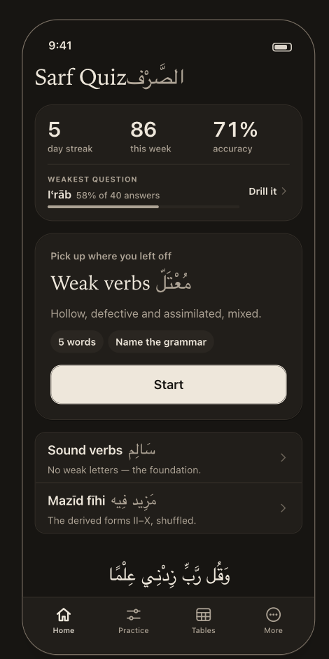

# Home

> **Job:** answer *"what do I do now?"* in one glance — one drill in front, one honest read of how you are doing, and a reason to start.
> **Tab:** Home · **Design:** `guide/06-home-results.md`, components *HomeScreen · StatStrip · DrillCard · Quote*.

<table>
<tr>
<td align="center"> <b>01</b> · Paper</td>
<td align="center"> <b>15</b> · Night</td>
</tr>
</table>

**Mock-up caveats.** The streak (5), week (86), accuracy (71%), and the weakest row (Iʿrāb · 58% of 40) are **sample data** — a
mock-up has no history. The drill names and descriptions are the real presets. The kicker "Pick up where you left off" would
be wrong on a first run (Q-05), and the weakest row's **Drill it ›** is deferred (Q-04).

---

## Anatomy, top to bottom

| # | Element | What it is |
|---|---|---|
| 1 | **Title** | `Sarf Quiz` in the serif screen title with `الصَّرْف` set beside it. No subtitle. |
| 2 | **Stat strip** *(card)* | Row 1 — three numbers: **day streak · this week · accuracy**. Divider. Row 2 — **Weakest question**: the kind, its accuracy and sample size, and a meter. *(The design ends this row in **Drill it ›**; that is deferred — Q-04 — so the row is display-only in v1.)* |
| 3 | **Hero drill** *(card)* | Kicker · title + Arabic · one-line description · two read-only pills (`5 words`, `Parse the word`) · full-width primary **Start**. |
| 4 | **The other two drills** *(inset-grouped list)* | Title + Arabic, description, chevron. |
| 5 | **Quote** | Arabic in Naskh 26px, translation in the serif italic, source small. **Typography, not a card** — no box, no coloured edge, no tap target. |
| 6 | **Tab bar** | System `TabView`; Home selected. |

## The three drills

Home drills are **always quiz type "Parse the word"** (D-14, renamed by D-79) — writing and derived nouns are a deliberate choice in Practice.
All three are one `Plan` with `tenses: [māḍī, muḍāriʿ]`, `voices: [maʿrūf]`, `moods: [marfūʿ]`.

| Drill | Arabic | Description (verbatim) | Verb types | Forms |
|---|---|---|---|---|
| **Sound verbs** | سَالِم | No weak letters — the foundation. | sālim, muḍāʿaf | I |
| **Weak verbs** | مُعْتَلّ | Hollow, defective and assimilated, mixed. | ajwaf, nāqiṣ, mithāl | I |
| **Mazīd fīhi** | مَزِيد فِيه | The derived forms II–X, shuffled. | every playable type | II–X |

- ⚠️ The prototype's Weak-verbs description ends "…and doubly-weak". **Drop it** — lafīf is off in v1 (design 07). A description must not promise content the build lacks.
- Verb types are stored as **engine types** (`ajwaf_waw`, `ajwaf_ya`); the group names above are expanded once, at the point a user's choice becomes a plan (D-33).
  Carrying a group name into plan data once silently killed this very drill.
- A preset intersects with the playable verb types, so a flagged-off type (mahmūz, lafīf) contributes nothing instead of emptying the plan.

🔒 **D-80** **A drill is five words and five parse cards.** One word is one question now, so the *bundle* — the first three
live per-word kinds applied to one word, `forWord()`, `QUESTIONS_PER_WORD`, the `Word i of N` tag — **dissolves**, and with it
the wrinkle that a word supporting only two kinds contributed two. Words never repeat within a drill. The QuizBar reads `2 of 5`.

The workload is roughly unchanged: five words × ~4 axes, against the old five words × three questions.

The one piece of the old bundle that **survives**, because it was never about bundling: about half the drawn words are flipped
to the majhūl, **and only when both voices exist**, so the choice of chart never gives the Voice row away. Under D-74 that is no
longer a drill trick but the general rule — *an axis that is live must be askable of every word drawn.*

🎨 **D-47** Home is **one hero drill and a quiet list**, not three Start buttons. *Three identical Start buttons made the app's first screen a decision.*

## The stat strip — three numbers and one thing to act on

All numbers are **queries over stored answers, never stored themselves** (D-55). No flame, no ring, no sparkline: "5 day streak".

| Number | Definition |
|---|---|
| **day streak** | Consecutive **local calendar days** with ≥1 answer, counting back from today. A day you haven't practised *yet* doesn't break it — yesterday's streak stands until a midnight passes with no answer. ⚠️ The prototype counts UTC dates and would miscount every evening for anyone west of UTC — do not port it (Q-16). |
| **this week** | Answers in the last 7 days, today included. |
| **accuracy** | All-time correct ÷ answered, whole percent. ❓ **Q-08** — this mixes recognition with production (see below). |
| **Weakest question** | The question **kind** (`category`) with the lowest accuracy among kinds with **≥ ~20 answers**. Label = the rule's own label ("Iʿrāb", "Who the doer is", "Write the word"); shows `58% of 40 answers` and a meter. Ties → the larger sample (assumed). |

- 🎨 **D-48** *A percentage over four answers is noise presented as a finding.* Below ≈20 answers in a kind there is no weakest kind and **the whole row is not drawn**.
  The meter is `ink-muted` on `fill`, **never red** — a low score is information, not a rebuke; both reds are spoken for.
- 🎨 **D-47** *Before the first drill* the strip reads **"No drills yet"** — an absence is not a zero, and a fresh install must not look like a bad score. The weakest row is absent.
- 🎨 **In v1 the three numbers are not a link.** `detailedStats` is off; a chevron would promise a screen that does not exist. The weakest row **would be** a link — to a drill, not a screen — but that action is deferred (Q-04): until it is decided the row is display-only, with **no button and no chevron**.
- 🎨 Why *weakest kind* and not seven bars of the week: "how much did I study on Tuesday" is answered once and can never be acted on. Accuracy per kind is the same stored data cut the other way, and it ends in a drill.

> ❓ **Q-08 · Home accuracy mixes recognition and production.** Your stats principle (D-56) says *write-the-word* is strictly harder than recognition and the two must be reported
> separately. The design's single accuracy figure merges them. **Spec assumes:** show the overall figure for v1 and record it as a
> **named comment in the code** — an accepted trade-off, as your rules require; the split belongs on the detailed stats screen.

### Drill it — deferred (Q-04)

The design's row ends in **Drill it ›**, which starts a session on that question kind. **You deferred it:** what plan each kind builds is undecided. *(D-72 removes half the original difficulty — there is no longer a bundle that covers only three kinds, and a plan that makes an axis live is all a drill needs. The decision is still yours.)*
So in v1 the weakest row shows the kind, its accuracy and sample size, and the meter — **no button, no chevron, not tappable.** A control that goes nowhere is exactly what this design is written against.

When you decide, it is **one button plus one declarative table** (rule id → plan overrides); the proposal is in `OPEN_QUESTIONS.md` § Q-04, and nothing else on Home changes.
🔒 **D-36** applies then: a drill narrows **which words** are drawn, never **which questions** are asked, so it is **diluted** by the other live kinds — accepted deliberately; do not add a per-kind field to the plan without re-opening D-36.

## Behaviour

- **Start (hero) / tap a list row** → build the session, present the quiz cover. Tapping a row **starts that drill** — there is no drill-detail screen in the design (assumed; Q-05).
- **Hero source** 🎨: the plan of the **last session**, else **Sound verbs** on a first run. Sessions already store their plan and mode, so nothing new is stored. The list underneath is the *other two* drills.
  > ❓ **Q-05 · The hero when the last session was not a preset** (custom Practice, endless, or a replay). **Spec assumes:** the hero is the last **preset** drill;
  > custom setups reach you through Results → *Same setup again*, not Home. First-run kicker reads **"Start here"**.
- **Quote:** one of 14 in `quotes.json`, picked at random each time Home is shown, its kind named (Qurʾān · Ḥadīth · Athar · Said by). Bundled, so it cannot fail to load.
  ⚠️ Every reference must be **verified against a primary source before release** — the file says so itself.

## States

| State | Shows |
|---|---|
| First run, no history | Strip → "No drills yet". Hero → Sound verbs, kicker "Start here". No weakest row. |
| History, no kind has ≥20 answers | Three numbers; **no** weakest row. |
| Normal | As the screenshot. |
| A preset cannot build questions | Must never happen in v1. **Guard:** a startup test that every shipped preset yields ≥1 question — the Weak-verbs drill was silently dead for weeks because it "failed safe". If it ever fails: Start disabled, one line saying why. |

## Data

**Reads:** `DRILL_PRESETS`; last session's `plan` + `mode`; `basicSummary()`; accuracy grouped by `category` (needs the ≈20 floor); `quotes.json`.
**Writes:** nothing. **Starts:** a `QuizRun` (mode = preset id).

## Acceptance

- [ ] Exactly one primary button on screen; the other two drills are rows, not buttons.
- [ ] Fresh install shows "No drills yet" and no percentage anywhere.
- [ ] Streak is by local day; a session at 23:30 local counts for that local day.
- [ ] Weakest row absent until a kind reaches ≈20 answers; meter is not red; **no *Drill it* button or chevron** (Q-04).
- [ ] Each of the three drills produces ≥1 question against the shipped lexicon (automated).
- [ ] A drill is **exactly 5 questions**, one per word; no `Word i of N` tag appears anywhere.
- [ ] The weakest-kind row still names an **axis** (`Iʿrāb`, `Who the doer can be`) — D-78's per-axis rows are what keep this working.
- [ ] Description strings match the table above (no "doubly-weak").
- [ ] Night renders (screenshot 15) with `midad-night` tokens; no hard-coded colours.
- [ ] Every Arabic string wrapped in an isolate; the hero title's Arabic sits in its own slot.
