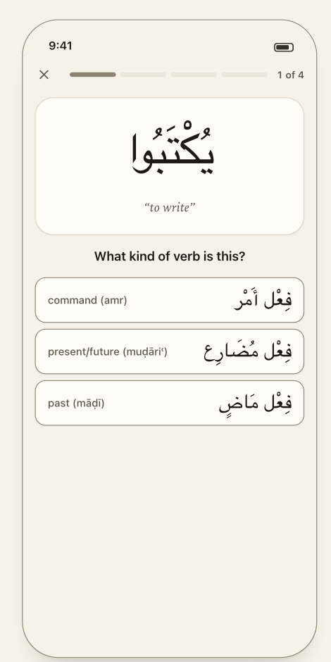
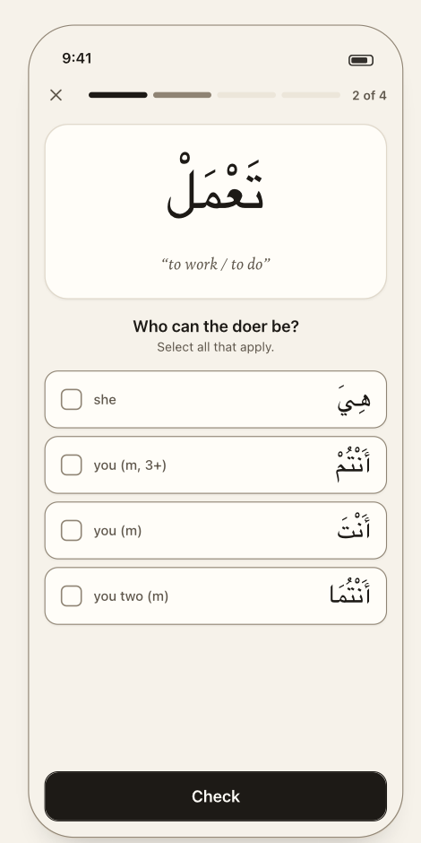
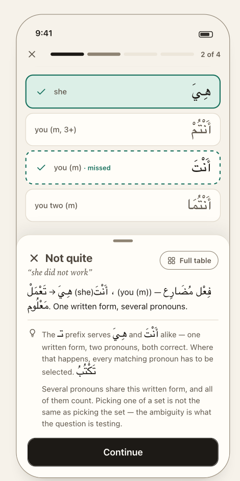
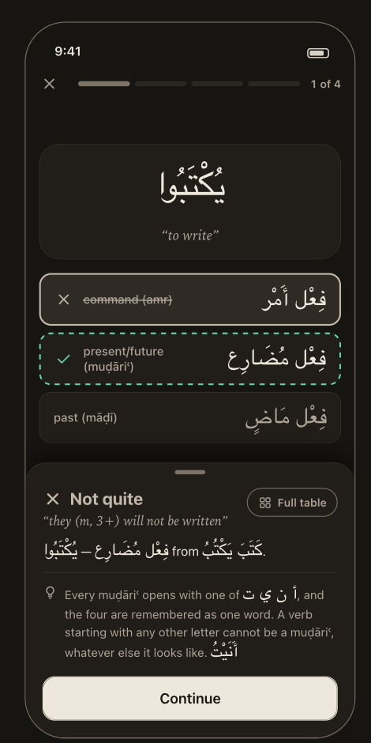

# Quiz — the answer loop

> **Job:** put one word in front of you, take your answer, and tell you what you missed **without the word leaving the screen**.
> **Presented as:** a full-screen cover over the tabs — no tab bar. **Design:** `guide/03-quiz.md`, components
> *QuizBar · PromptCard · AnswerOption · AnswerSheet · ParadigmGrid · RootTiles · SignText*.
> **What each question kind asks, and how it is graded:** [`reference/questions.md`](../reference/questions.md).

**The three answer shapes, at rest and graded**

<table>
<tr>
<td align="center"> <b>02</b> · single answer, at rest</td>
<td align="center"> <b>03</b> · single answer, graded</td>
<td align="center"> <b>04</b> · <i>Full table</i> peek</td>
</tr>
<tr>
<td align="center"> <b>05</b> · checklist, at rest</td>
<td align="center"> <b>06</b> · checklist, graded</td>
<td align="center"> <b>07</b> · <i>Match the meaning</i>, correct</td>
</tr>
<tr>
<td align="center"> <b>08</b> · typed answer, one ḥaraka off</td>
<td align="center"> <b>16</b> · Night</td>
<td></td>
</tr>
</table>

---

## Entering and leaving

| From | Starts |
|---|---|
| Home hero / list row | a Home drill (5 words × ≤3 questions) |
| Home *Drill it* | a drill on the weakest kind (Q-04) |
| Practice *Start* | a session from the plan; fixed 5 / 10 / 20 or endless |
| Results *Same setup again* | the same plan, a fresh draw |
| Results *Drill these again* | the missed questions **verbatim** (D-50) |

Ends in **Results** (inside the same cover). ✕ or *Done* returns to the **tab you started from** (D-09). The quiz has no tab of its own.

---

## Anatomy (screenshot 02)

Top to bottom: **QuizBar** · **PromptCard** · **ask** (+ optional **hint**) · **options** · primary action *(only when needed)*.

### QuizBar — where you are, and the way out

- **✕** at left (SF `xmark`). **Progress** in the middle. **Count** at right.
- Fixed-length sessions: **ticks grouped by word.** A Home drill is five words with two or three questions each, so it reads
  **"Word 2 of 5"**; a Practice run of ten is ten ticks, "3 of 10". Tick states: done · now · upcoming.
  🎨 **Ticks never encode right and wrong** — a bar that turns red mid-quiz teaches nothing; the score belongs to Results.
- **Endless has no bar** (D-29): there is nothing to be a fraction of. It shows the **running score** (✓ right, ✕ wrong) and an **End quiz** button.
  No total exists — `null`, never `Infinity`.
- The bundle tag ("Word 2 of 5") lives **here**, not on the card. The card carries no category chip: the ask says what is being asked. 🎨

### PromptCard — the subject of the question

Six shapes, one per `prompt.kind`; the view switch must be **exhaustive** so a seventh fails loudly instead of rendering a bare word.
**Every letter on the card is `ink`** — marking the sign before the answer would give it away.

| kind | Shows | Used by |
|---|---|---|
| `word` | the conjugated word at `arabic-hero` (60px), its gloss in serif italic | tense · voice · doer · iʿrāb |
| `citation` | both tenses (`خَرَجَ يَخْرُجُ`) at `arabic-display`, gloss | bāb |
| `spec` | **root tiles**, gloss, and the target as read-only **pills in reading order**: form → tense → voice → iʿrāb → pronoun | *Write the word* |
| `meaning` | the **English reading alone** at `meaning-display`, root tiles beneath. **No Arabic — any would be the answer** | *Match the meaning* |
| `derivedRequest` | the verb, gloss, pills (`Form X`, `اسْم مَفْعُول`) | pick the derivative |
| `derivedWord` | the derived noun at `arabic-hero`, gloss | which derivative / which form |

The `meaning` prompt **has no text field by construction** — the type cannot hold the answer.
After grading the card **compacts** (word 60px → 42px) so options and sheet fit together.

### The ask

One question in one sentence, as a **headline outside the card** (the card is the subject, the ask is the question). Anything about
*how* to answer goes on a **second line, the hint** — `Select all that apply.` (screenshot 05). The typed question's hint, *Fully vowelled — the final ḥaraka counts.*, is the prototype's.
Exact sentences: `reference/questions.md`.

### Options — one answer, in fixed slots

**English leads, small; Arabic trails, large — each in its own isolated slot** (never one mixed inline run: that is what turns
`I` + `الثلاثي المجرد` into `الثلاثي المجرد I`). Minimum height **60pt** so a 28pt Arabic word keeps its marks clear. Options are shuffled;
selection and grading are by **value key**, never by position (architecture invariant: store semantically — `ARCHITECTURE.md` §9).

- `Match the meaning` and `Derived nouns` options are **Arabic-only** — an English label would restate or give away the answer (D-21, D-23).
- **Checklist questions show a tick box from the first render**, before any tap. That is what says "this is a selection".

---

## Answering — the interaction is decided by the question **kind**, not by the draw

🔒 **D-60** Each question kind declares `select: 'one' | 'many'` in the rule registry. Grading's "multi" stays *derived* (`correct.length > 1`) — a different fact, and it keeps grading's single owner.

| `select` | Interaction | Button |
|---|---|---|
| `one` | **One tap answers.** Grading is immediate. | none |
| `many` | Tick boxes visible up front. Tap toggles. **Check** submits. | **Check** — primary, bottom, disabled until ≥1 ticked |
| typed | Arabic field; return or **Check** submits | **Check** — disabled until the field is non-empty |

- **Doer is always `many`.** The prototype made it a checklist only when the draw happened to have >1 right answer while *always* saying "Select all that apply" — so the first tap sometimes submitted.
  Now the instruction and the interaction agree, and **how many answers there are stays hidden, which is the thing being taught**: *deciding whether a form is ambiguous is the skill.* Cost: one extra tap when the answer is single. 🎨
- **Grading a checklist is all-or-nothing** — an exact set match. Picking one of a pair is not picking the pair (تَكْتُبُ is هِيَ *and* أَنْتَ); a correct option plus a wrong one is wrong.
- No skip button (D-10). No undo after a single-tap answer.

> ❓ 🔴 **Q-02 · The voice question is also multi-answer, and the design did not say what to do.** In ~72 lexicon cells both voices spell the same word
> (ajwaf māḍī `خِفْتَ`/`بِعْتَ`; muḍāʿaf Form III `يُمَاسُّ`), so both answers are correct. Today the ask *changes* — "Select all that apply." appears only then — which **leaks the answer count**,
> exactly what D-60 removes for doer. **Spec assumes: voice is `many` too**, for the same reason. Costs a tap on every voice question. Alternatives in `OPEN_QUESTIONS.md`.

---

## After the answer

### Option states (six)

Colour is **never the only signal** — every state has a mark and a word too.

| State | When | Look |
|---|---|---|
| *(none)* | untouched | raised fill, `line-strong` border |
| `picked` | checklist, ticked, before Check | `select-soft` fill |
| `correct` | right, and you picked it | `correct-soft` fill, solid teal border, ✓ |
| `missed` | right, and you did **not** pick it | **dashed** teal border, ✓; in a checklist labelled `· missed` (screenshot 06) |
| `wrong` | your pick, and wrong | ✕, **English struck through**, `wrong-soft` fill, neutral ink border |
| `rest` | everything else | quiet, dimmed |

`wrong` is deliberately **not red** (D-63): red is spoken for.

### The sign — red, only after the answer

`sign` marks **the letters that carry the grammar**, and only once the answer is in — *the sign is the answer.* In v1 that is exactly two things:

1. **The diverging cluster** in a typed answer (both lines of the diff).
2. **The governing particle** in a *Match the meaning* option (`لَنْ`, `لَمْ`) — shown red in **every** option once graded (screenshot 07).

Later, once the engine returns prefix/stem/suffix, the affixes of the word itself (D-61 — documented, **not built**). Mark **whole grapheme clusters**, never a bare mark
(a ḍamma alone detaches from its letter), and only by **colour** — never bold or resize part of a word; it breaks the joining.

### The answer sheet — feedback rises, it is not appended

🎨 **D-64** The sheet **docks to the bottom**; the word and options stay on screen and scrollable above it. Build it as a
**bottom safe-area inset** (`.safeAreaInset(edge: .bottom)`), **not** a modal sheet — a modal dims and blocks the thing the learner is meant to look at.
Rises in **260ms**. The graded options scroll into view automatically.

**Four blocks and one action** (screenshots 03, 06, 07, 08):

| # | Block | Content |
|---|---|---|
| 1 | **Head** | **Verdict** — icon + word: ✓ **Correct** / ✕ **Not quite** (icon + word + colour: three channels, because one fails for someone). **The reading under it**, serif italic: “they (m, 3+) will not be written”. **Full table** — small button at the right (SF `square.grid.2x2`). |
| 2 | **Diff** | *Typed answers only, on a miss.* See below. |
| 3 | **Explanation** | Prose, with **every Arabic run bidi-isolated** (D-62). |
| 4 | **Tips** | ≤ **2**, **wrong answers only**. The lightbulb mark (SF `lightbulb`) is on the **first tip only** and the rest align under it, so two read as one note. Empty list → renders nothing, never filler. |
| — | **Continue** | The **only** action: full width, primary, under the thumb. Reads **See results** on the last question. |

**Why one action.** *Full table* is a small button in the head, not a second button beside Continue: two buttons on one line make you choose before you have read
anything, and only one of them moves the session on. The reading and the verdict share a block because they are one thought — what you said, and what the word meant.

**Accepted consequence.** On a small phone, a four-option question plus a two-tip sheet does not fit at once. The card compacts and the options scroll under the sheet.

The verdict is a **word, an icon, a colour and a haptic** — four channels for one fact. 🎨 D-65

### Tips

🔒 **D-28** A tip fires on the **confusion**, not the word — "the تـ prefix serves both هِيَ and أَنْتَ" — which is only knowable because a stored answer keeps `given` and `expected` semantically.
🔒 **D-05** They take the slot AI Explain fills later. Wrong answers only; none on a correct answer; pure functions of `(question, answer)`; no network. Registry, seed content and coverage: `reference/questions.md`.

---

## *Full table* — the peek

🔒 **D-45** 🎨 *Full table* opens the **paradigm grid over the quiz** with the cell you just met outlined, and closes back to the question. **It must not end the run.**
(The prototype navigated to the Tables tab, dropped the run, and — because it only saved at session end — **lost the session's answers**.)

<table>
<tr>
<td></td>
<td valign="top">

- A real sheet over everything (the quiz behind it is dimmed). Header: citation · **chart label** — `كَتَبَ يَكْتُبُ · Form I · muḍāriʿ · majhūl · manṣūb`. Primary **Back to the question**.
- **Layout:** columns **one · two · three+** (مُفْرَد · مُثَنًّى · جَمْع), **read right to left**; rows he · she · you (m) · you (f) · I/we. `نَحْنُ` spans two columns.
  A heavier rule starts each person group. The **amr** grid is two rows (2nd person only). Each cell: the pronoun small above the word (`arabic-cell` 24px).
- **The hit** is outlined in `select` — **not** `sign`, which belongs to letters. From `identity.slot`; for a **doer** question **every correct slot** is outlined — that is the lesson (تَنْصُرُ is هِيَ *and* أَنْتَ).
- **Only for questions that name a chart** (a tense and a slot). Derived-noun and bāb questions have none → the button is not shown.
- **Largest accessibility text sizes:** three columns of vowelled Arabic cannot fit → the peek falls back to the **14-row list** Tables uses.

</td>
</tr>
</table>

The grid is the quiz's peek **only**; Tables browses the same `fullTable()` as a list (D-45). Colouring the affixes down a column — the thing that turns a chart into a lesson — waits for prefix/stem/suffix (D-61).

---

## Typed answers — *Write the word*

<table>
<tr>
<td></td>
<td valign="top">

**The cue is a recipe:** root tiles → gloss → pills in reading order. Ask: **Write this verb** · hint: *Fully vowelled — the final ḥaraka counts.* (prototype copy; the mock shows only the graded state).

**The field:** right-to-left, autocorrect and spellcheck off, **the system Arabic keyboard entirely** (D-25) — letters *and* ḥarakāt, entered the way iOS provides them (long-press). **No accessory row, no custom keys.**
Keyboard avoidance: the field and **Check** stay visible.

**Grading** (D-26): typed text → **NFC** → trim → **strict equality** with the engine's own string. **The final ḥaraka counts** — the ending is the lesson; a bare `يَنْصُر` teaches the opposite of the app's point.

**On a miss — the diff:** your word **stacked over the right one**, right-aligned, the **first diverging cluster marked in both** (colour only), then a one-line note. `divergeAt` is a cluster index — `null`, never `-1`, for choice answers.

</td>
</tr>
</table>

> ❓ **Q-11 · The diff note.** The mock says *"It diverges at letter 4. On a muḍāriʿ the last ḥaraka is the iʿrāb: marfūʿ takes the ḍamma."* and the guide says the marks are named ("you wrote a fatḥa, it takes a ḍamma").
> **Neither exists in the prototype** — it only underlines. **Spec assumes:** always "It diverges at letter N."; name the marks only when the two clusters differ in exactly one ḥaraka,
> from a small declarative table; anything more comes from a matching tip.

### The Arabic keyboard gate — a real feature, not polish

iOS offers only keyboards the user has installed, and **the Arabic keyboard is not installed by default**. Without it *Write the word* is **unanswerable**, not merely hard. 🔒 **D-27**

- **Check when a *Write the word* session starts** (Practice *Start*, or *Same setup again*): `UITextInputMode.activeInputModes` has an entry whose `primaryLanguage` starts with `ar`.
- **If none:** do not start. Present a sheet — *"Add the Arabic keyboard"* — with the path **Settings → General → Keyboard → Keyboards → Add New Keyboard → Arabic**, an **Open Settings** button, and **Not now** (back to Practice).
  An app cannot force a keyboard language and cannot deep-link to that Settings page; do not plan around either.
- Not in the design (Q-10) — the wording above is the default.

---

## Endless mode

🔒 **D-29** Questions **stream**; the bar is replaced by the running score and **End quiz**. **End quiz** → Results with the count actually served (or straight out if nothing was answered).
An endless session records only the questions it *served*, never the ones it could have. The stream avoids repeating anything from the **last 30 questions** (a sliding window, so a small pool never starves) and ends on its own only if the pool is genuinely dry.

## Quitting, ending, interruptions

- **✕:** if ≥1 question has been answered → a confirmation ("Quit this quiz?", destructive *Quit* / *Cancel*); with none answered it just leaves.
  **Quitting ends the session and keeps the answers** — an abandoned quiz still happened. (An alert is state in SwiftUI, not a blocking call.)
- 🔒 **D-51** **Every answer is persisted the moment it is given**, not when the session ends. The prototype violates this — do not port it (`recordAnswer` only appended to memory; the one `save()` sat in `endSession()`).
- **Killed or backgrounded mid-quiz:** answers already given stay in history (per-answer writes). The in-flight run is **not** resumed. ❓ **Q-03** (recommended: no resume).
- Sessions with **no** answers are discarded, not stored empty.

## Haptics and motion

🎨 **D-65** Grade with a **success** or **error** haptic. Sheet rises in **260ms**; option states cross-fade in **120ms**; **reduced motion drops both** (drop the transition, do not substitute another). No confetti, no streak animation.

## Accessibility (quiz-specific — the rest is in `reference/platform.md`)

Options ≥60pt; controls ≥44pt; verdict never colour-only; **VoiceOver reads an Arabic word with a spelled-letter option**; Dynamic Type at the largest sizes must not clip stacked marks (explicit row heights — Scheherazade's metrics are generous, D-59);
the checklist exposes each option as a toggle with its state; the sheet is announced when it rises.

---

## Mock-up caveats

- **Screenshots 03, 06, 07, 08 show the bidi bug D-62 fixes** — e.g. in 03 `فِعْل مُضَارِع – يُكْتَبُوا from كَتَبَ يَكْتُبُ.` renders its runs out of order. The isolate rule removes it; **do not reproduce the ordering**.
- The grab handle on the sheet is decorative in the mock; the inset is not draggable (assumed).
- Screenshot 08 shows the chip `maʿrūf مَعْلُوم` — a transliteration that does not match the word beside it (Q-14).
- The four screens are four different questions of one 4-question mock session ("1 of 4" … "4 of 4"); a real Home drill groups ticks by word.

## Acceptance

- [ ] Feedback never scrolls the prompt card off screen; the sheet is an inset, not a modal.
- [ ] Doer is a checklist with visible tick boxes on every draw — including draws with a single right answer.
- [ ] Partial checklist selection grades wrong; the missed option is dashed and labelled `· missed`.
- [ ] No `sign` colour on any prompt card, ever; only diverging cluster / governing particle after grading.
- [ ] A wrong answer shows ≤2 tips; a right answer shows none.
- [ ] *Full table* opens the peek, outlines the hit (all correct slots for doer), returns to the same question, and **does not end the run**; absent for derived-noun and bāb questions.
- [ ] Quit → answers already given are in history; ending endless with 0 answers stores nothing.
- [ ] Killing the app after answer 3 leaves 3 answers stored.
- [ ] Typed: input is NFC-normalised before comparison; one wrong ḥaraka is "Not quite" with that cluster marked in both lines.
- [ ] *Write the word* without an Arabic keyboard installed never reaches an unanswerable question.
- [ ] Reduced motion removes the sheet and option transitions; every verdict has icon + word + colour + haptic.
- [ ] Arabic mixed into English text is isolated (FSI…PDI); no run reorders.
