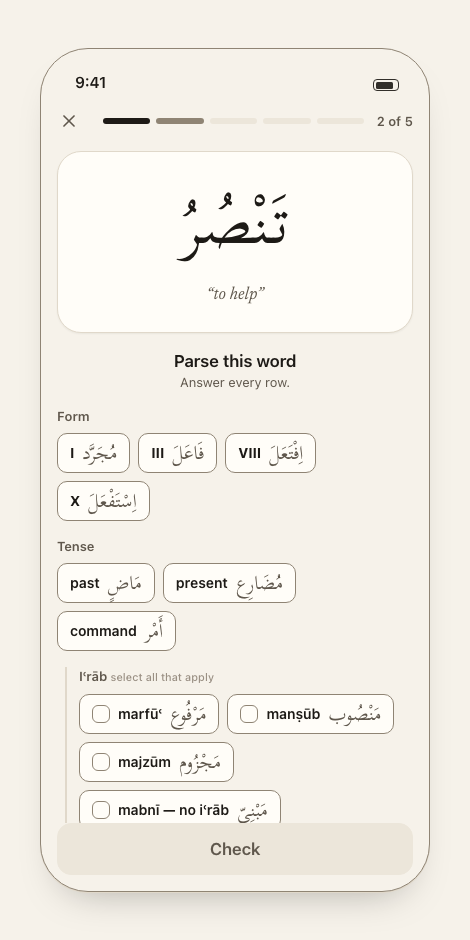
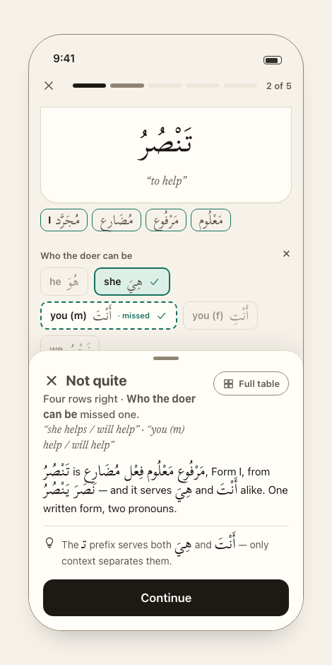
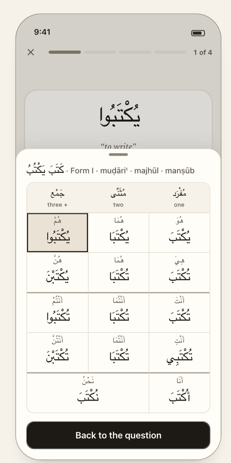
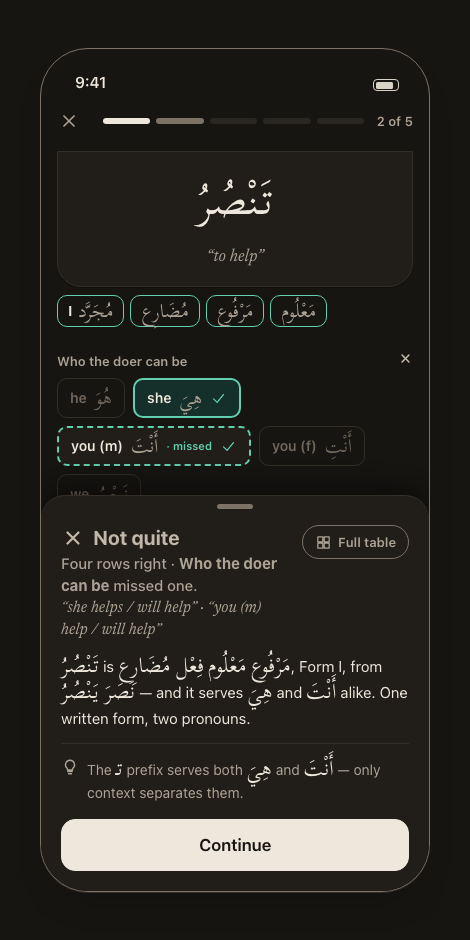
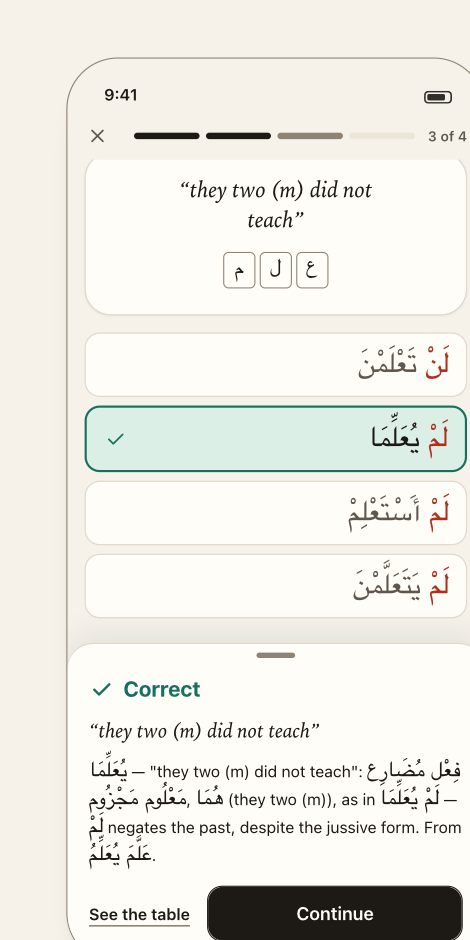
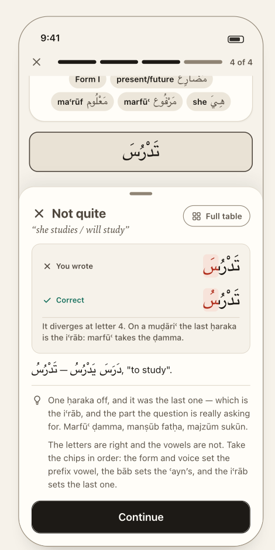

# Quiz — the answer loop

> **Job:** put one word in front of you, take your answer, and tell you what you missed **without the word leaving the screen**.
> **Presented as:** a full-screen cover over the tabs — no tab bar. **Design:** `guide/03-quiz.md`, components
> *QuizBar · PromptCard · AnswerOption · AnswerSheet · ParadigmGrid · RootTiles · SignText*.
> **What each question kind asks, and how it is graded:** [`reference/questions.md`](../reference/questions.md).

**The three answer shapes, at rest and graded**

<table>
<tr>
<td align="center"> <b>02</b> · <b>parse card</b>, at rest</td>
<td align="center"> <b>03</b> · <b>parse card</b>, one row missed</td>
<td align="center"> <b>04</b> · <i>Full table</i> peek</td>
</tr>
<tr>
<td align="center"> <b>16</b> · parse card, Night</td>
<td align="center"><b>ParseAxes</b> the seven row states — <a href="../../design/midad/previews/ParseAxes.html">open the preview</a></td>
<td align="center"> <b>07</b> · <i>Match the meaning</i>, correct</td>
</tr>
<tr>
<td align="center"> <b>08</b> · typed answer, one ḥaraka off</td>
<td></td>
<td></td>
</tr>
</table>

---

## Entering and leaving

| From | Starts |
|---|---|
| Home hero / list row | a Home drill — **5 words, 5 parse cards** (D-80) |
| Home *Drill it* | *deferred — not built in v1 (Q-04)* |
| Practice *Start* | a session from the plan; fixed 5 / 10 / 20 or endless |
| Results *Same setup again* | the same plan, a fresh draw |
| Results *Drill these again* | the missed questions **verbatim** (D-50) |

Ends in **Results** (inside the same cover). ✕ or *Done* returns to the **tab you started from** (D-09). The quiz has no tab of its own.

---

## Anatomy (screenshot 02)

Top to bottom: **QuizBar** · **PromptCard** · **ask** (+ optional **hint**) · **options** · primary action *(only when needed)*.

### QuizBar — where you are, and the way out

- **✕** at left (SF `xmark`). **Progress** in the middle. **Count** at right.
- Fixed-length sessions: **ticks grouped by word.** A Home drill is five words with two or three questions each, so it reads
  **"Word 2 of 5"**; a Practice run of ten is ten ticks, "3 of 10". Tick states: done · now · upcoming.
  🎨 **Ticks never encode right and wrong** — a bar that turns red mid-quiz teaches nothing; the score belongs to Results.
- **Endless has no bar** (D-29): there is nothing to be a fraction of. It shows the **running score** (✓ right, ✕ wrong) and an **End quiz** button.
  No total exists — `null`, never `Infinity`.
- 🔒 **D-80** There is **no bundle tag any more.** One word is one question, so the ticks are simply one per word and the count reads `2 of 5`. The card still carries no category chip: the ask says what is being asked. 🎨

### PromptCard — the subject of the question

**Five** shapes, one per `prompt.kind`; the view switch must be **exhaustive** so a sixth fails loudly instead of rendering a bare word.
**Every letter on the card is `ink`** — marking the sign before the answer would give it away.

| kind | Shows | Used by |
|---|---|---|
| `word` | the conjugated word at `arabic-hero` (60px), its gloss in serif italic | **Parse the word** — all five axes |
| `spec` | **root tiles**, gloss, and the target as read-only **pills in reading order**: form → tense → voice → iʿrāb → pronoun | *Write the word* |
| `meaning` | the **English reading alone** at `meaning-display`, root tiles beneath. **No Arabic — any would be the answer** | *Match the meaning* |
| `derivedRequest` | the verb, gloss, pills (`Form X`, `اسْم مَفْعُول`) | pick the derivative |
| `derivedWord` | the derived noun at `arabic-hero`, gloss | which derivative / which form |

🔒 **D-76** The **`citation` kind is gone** with the bāb question — it existed only to show both tenses, which only the bāb needed.
It was six kinds; removing one is the rare change that makes an exhaustive switch shorter. *If a later feature wants a citation
prompt back, it comes back as a kind, not as a `word` with a space in it.*

The `meaning` prompt **has no text field by construction** — the type cannot hold the answer.
After grading the card **compacts** (word 60px → 42px) so the axes and the sheet fit together.

### The ask

One question in one sentence, as a **headline outside the card** (the card is the subject, the ask is the question). Anything about
*how* to answer goes on a **second line, the hint**. The parse card asks **“Parse this word”** with the hint **“Answer every row.”**;
the typed question's hint is *Fully vowelled — the final ḥaraka counts.* Exact sentences: `reference/questions.md`.

After grading, the ask is **hidden** — the row labels have taken over saying what was asked, and the sheet needs the room.

### The axes — five labelled rows of chips 🔒 D-72

The parse card's answer area is **not** a stack of `AnswerOption`s: five of them at 60pt would be a thousand points of screen.
It is **five labelled rows of `Chip`s** — `Form · Tense · (Iʿrāb) · Voice · Who the doer can be` — in **the same visual grammar
as Practice's `ChartScope`**, iʿrāb indented under Tense behind a rule. A student configures a pool in that shape and is then
asked in that shape.

- **Chips, not segmented controls**, even for a fixed set like Tense. 🎨 Rule 5 says a fixed set meant to be compared is a
  segmented control — but **a segmented control has no empty state**, and an answer control must be able to say "nothing chosen
  yet". *Named exception to rule 5; the reason is the empty state, not the set.*
- Each chip keeps its halves in **fixed slots**, English or numeral first, Arabic after, each isolated — the rule that stops
  `I` + `الثلاثي المجرد` rendering as `الثلاثي المجرد I`.
- Chips within a row are **shuffled**; selection and grading are by **value key**, never by position (architecture invariant —
  `ARCHITECTURE.md` §9).
- **Rows with `select: 'many'` show a tick box from the first render** and carry *select all that apply* on the label. That is
  a property of the axis, never of the draw, so it leaks nothing (D-60, D-70, D-74).
- The **other three quiz types keep `AnswerOption`** exactly as before — one question, one stack, 60pt minimum. `Match the
  meaning` and `Derived nouns` options stay Arabic-only (D-21, D-23).

---

## Answering — the interaction is declared, never inferred from the draw

🔒 **D-60** `select: 'one' | 'many'` is declared on the **axis** (for a parse card) or on the **kind** (for the other three types).
Grading's "multi" stays *derived* — a different fact, and it keeps grading's single owner.

| Question | Interaction | Button |
|---|---|---|
| **Parse the word** | every row is filled in, in any order; a `one` row replaces, a `many` row toggles | **Check** — primary, in the dock, **disabled until every live row has ≥1 chip** |
| the other types, `one` | **One tap answers.** Grading is immediate. | none |
| the other types, `many` | Tick boxes visible up front. Tap toggles. **Check** submits. | **Check** — disabled until ≥1 ticked |
| typed | Arabic field; return or **Check** submits | **Check** — disabled until the field is non-empty |

- 🔒 **D-74 · Every row is answered for the written form, and every reading it admits is correct.** `تَنْصُرُ` is هِيَ **and**
  أَنْتَ; `خِفْتَ` is maʿrūf **and** majhūl; a dual muḍāriʿ conflates manṣūb and majzūm. D-20's doer rule is now **the rule of
  the screen**, not a special case.
- **A row is all-or-nothing** — an exact set match. Picking one of a pair is not picking the pair; a correct chip plus a wrong
  one is wrong.
- 🔒 **D-77 · The card is right only if every row is.** The session counts **words**, `7 / 10`. Four-of-five scores nothing —
  and still records four correct axes (D-78), so nothing is lost but the point.
- 🔒 **D-75 · The iʿrāb row is always shown when live**, with a **`mabnī — no iʿrāb`** chip for a māḍī or amr. A row that
  appeared only on a muḍāriʿ would answer the Tense row for free.
- **Check is disabled until every row is answered**, not until one is. The hint says so: *Answer every row.* There is no
  partial submit — a blank row would have to be scored, and "unanswered" is not "wrong".
- No skip button (D-10). **There is no undo after Check**, but there is no longer an accidental submit either: a single tap
  never grades a parse card, which is what made the old doer question leak.

> 🔒 **D-70 is subsumed.** Voice is still always a checklist, for the reason it always was. But its recorded cost — *"an extra
> tap and Check on every voice question"* — **is gone**: there is one Check for the whole card. The decision stands; the
> trade-off it bought has been paid off by D-72.

---

## After the answer

### Option and chip states (six, and they are the same six)

Colour is **never the only signal** — every state has a mark and a word too. **A chip takes the same six states an
`AnswerOption` does**, so there is one correctness vocabulary on the screen and not two.

| State | When | Look |
|---|---|---|
| *(none)* | untouched | raised fill, `line-strong` border |
| `picked` | `many` row, ticked, before Check | `select-soft` fill |
| `correct` | right, and you picked it | `correct-soft` fill, solid teal border, ✓ |
| `missed` | right, and you did **not** pick it | **dashed** teal border, ✓, labelled `· missed` |
| `wrong` | your pick, and wrong | ✕, **English struck through**, `wrong-soft` fill, neutral ink border |
| `rest` | everything else | quiet, dimmed |

`wrong` is deliberately **not red** (D-63): red is spoken for.

**The row carries a verdict too.** Each axis label takes a ✓ or ✕ at its right, so which rows you missed is scannable without
reading chips — and it is what the collapse below keys on.

### The graded card — right rows collapse, missed rows stay 🔒 D-72

**This is not tidying; without it the design does not work.** Five expanded rows plus the answer sheet do not fit on a phone,
and the sheet is a bottom inset — so the row you are meant to review ends up *underneath* the thing explaining it. Measured on
the mock-up at 390×844: five rows overflow by ~220pt.

1. A row that was **right collapses to one line** — its label, the chip you picked, a tick. The distractors have done their
   work and are not worth the room.
2. A row with a **miss stays expanded**, with every chip in its state.
3. The card **opens scrolled to the first row with a miss**, extending the rule the quiz already had (*"the graded options
   scroll into view automatically"*). With five axes that stops being a nicety.

*Consequence, accepted:* on a card where **every** row is right there is nothing expanded — five one-line rows and the sheet.
That is the correct outcome, not an empty state: there is nothing to look at again.

### The sign — red, only after the answer

`sign` marks **the letters that carry the grammar**, and only once the answer is in — *the sign is the answer.* In v1 that is exactly two things:

1. **The diverging cluster** in a typed answer (both lines of the diff).
2. **The governing particle** in a *Match the meaning* option (`لَنْ`, `لَمْ`) — shown red in **every** option once graded (screenshot 07).

Later, once the engine returns prefix/stem/suffix, the affixes of the word itself (D-61 — documented, **not built**). Mark **whole grapheme clusters**, never a bare mark
(a ḍamma alone detaches from its letter), and only by **colour** — never bold or resize part of a word; it breaks the joining.

### The answer sheet — feedback rises, it is not appended

🎨 **D-64** The sheet **docks to the bottom**; the word and options stay on screen and scrollable above it. Build it as a
**bottom safe-area inset** (`.safeAreaInset(edge: .bottom)`), **not** a modal sheet — a modal dims and blocks the thing the learner is meant to look at.
Rises in **260ms**. The graded options scroll into view automatically.

**Four blocks and one action** (screenshots 03, 06, 07, 08):

| # | Block | Content |
|---|---|---|
| 1 | **Head** | **Verdict** — icon + word: ✓ **Correct** / ✕ **Not quite** (icon + word + colour: three channels, because one fails for someone). On a parse card, a line under it **names the rows that went wrong**: *Four rows right · **Who the doer can be** missed one.* Then **the reading**, serif italic. **Full table** — small button at the right (SF `square.grid.2x2`). |
| 2 | **Diff** | *Typed answers only, on a miss.* See below. |
| 3 | **Explanation** | Prose, with **every Arabic run bidi-isolated** (D-62). On a parse card it reads the word out on every axis at once — `تَنْصُرُ is فِعْل مُضَارِع مَعْلُوم مَرْفُوع, Form I, from نَصَرَ يَنْصُرُ` — **and it is where the bāb now lives** (D-76). |
| 4 | **Tips** | ≤ **2**, **wrong answers only**. On a parse card a tip is matched **per wrong axis** and the first two of the card are shown — so a card missing two rows can still only spend two lines. The lightbulb mark (SF `lightbulb`) is on the **first tip only**. Empty list → renders nothing, never filler. |
| — | **Continue** | The **only** action: full width, primary, under the thumb. Reads **See results** on the last question. |

**Why one action.** *Full table* is a small button in the head, not a second button beside Continue: two buttons on one line make you choose before you have read
anything, and only one of them moves the session on. The reading and the verdict share a block because they are one thought — what you said, and what the word meant.

**Accepted consequence.** On a small phone, a question plus a two-tip sheet does not fit at once. The card compacts and the
answer area scrolls under the sheet — and for a parse card the collapse-and-scroll rule above is what keeps the missed row visible.

⚠️ **The reading of an ambiguous word must list every valid reading.** A parse card has one sheet for the whole word, so its
reading cannot be scoped to "whichever axis was asked". A card that grades both هِيَ and أَنْتَ correct and then reads the word
as one of them contradicts its own grading. `“she helps / will help” · “you (m) help / will help”`. This was a deferred fix in
`reference/questions.md`; **D-72 makes it required.**

The verdict is a **word, an icon, a colour and a haptic** — four channels for one fact. 🎨 D-65

### Tips

🔒 **D-28** A tip fires on the **confusion**, not the word — "the تـ prefix serves both هِيَ and أَنْتَ" — which is only knowable because a stored answer keeps `given` and `expected` semantically.
🔒 **D-05** They take the slot AI Explain fills later. Wrong answers only; none on a correct answer; pure functions of `(question, answer)`; no network. Registry, seed content and coverage: `reference/questions.md`.

---

## *Full table* — the peek

🔒 **D-45** 🎨 *Full table* opens the **paradigm grid over the quiz** with the cell you just met outlined, and closes back to the question. **It must not end the run.**
(The prototype navigated to the Tables tab, dropped the run, and — because it only saved at session end — **lost the session's answers**.)

<table>
<tr>
<td></td>
<td valign="top">

- A real sheet over everything (the quiz behind it is dimmed). Header: citation · **chart label** — `كَتَبَ يَكْتُبُ · Form I · muḍāriʿ · majhūl · manṣūb`. Primary **Back to the question**.
- **Layout:** columns **one · two · three+** (مُفْرَد · مُثَنًّى · جَمْع), **read right to left**; rows he · she · you (m) · you (f) · I/we. `نَحْنُ` spans two columns.
  A heavier rule starts each person group. The **amr** grid is two rows (2nd person only). Each cell: the pronoun small above the word (`arabic-cell` 24px).
- **The hit** is outlined in `select` — **not** `sign`, which belongs to letters. From `identity.slot`; **every correct slot of the doer row is outlined** — that is the lesson (تَنْصُرُ is هِيَ *and* أَنْتَ), and on a parse card it is always shown because the doer row is always there.
- **Only for questions that name a chart** (a tense and a slot). A **parse card always names one**, so the peek is always there — it is the type that benefits most from it. Derived-noun questions have no chart → the button is not shown. *(The bāb question, the other chartless one, is gone — D-76.)*
- **Largest accessibility text sizes:** three columns of vowelled Arabic cannot fit → the peek falls back to the **14-row list** Tables uses.

</td>
</tr>
</table>

The grid is the quiz's peek **only**; Tables browses the same `fullTable()` as a list (D-45). Colouring the affixes down a column — the thing that turns a chart into a lesson — waits for prefix/stem/suffix (D-61).

---

## Typed answers — *Write the word*

<table>
<tr>
<td></td>
<td valign="top">

**The cue is a recipe:** root tiles → gloss → pills in reading order. Ask: **Write this verb** · hint: *Fully vowelled — the final ḥaraka counts.* (prototype copy; the mock shows only the graded state).

**The field:** right-to-left, autocorrect and spellcheck off, **the system Arabic keyboard entirely** (D-25) — letters *and* ḥarakāt, entered the way iOS provides them (long-press). **No accessory row, no custom keys.**
Keyboard avoidance: the field and **Check** stay visible.

**Grading** (D-26): typed text → **NFC** → trim → **strict equality** with the engine's own string. **The final ḥaraka counts** — the ending is the lesson; a bare `يَنْصُر` teaches the opposite of the app's point.

**On a miss — the diff:** your word **stacked over the right one**, right-aligned, the **first diverging cluster marked in both** (colour only), then a one-line note. `divergeAt` is a cluster index — `null`, never `-1`, for choice answers.

</td>
</tr>
</table>

> ❓ **Q-11 · The diff note.** The mock says *"It diverges at letter 4. On a muḍāriʿ the last ḥaraka is the iʿrāb: marfūʿ takes the ḍamma."* and the guide says the marks are named ("you wrote a fatḥa, it takes a ḍamma").
> **Neither exists in the prototype** — it only underlines. **Spec assumes:** always "It diverges at letter N."; name the marks only when the two clusters differ in exactly one ḥaraka,
> from a small declarative table; anything more comes from a matching tip.

### The Arabic keyboard gate — a real feature, not polish

iOS offers only keyboards the user has installed, and **the Arabic keyboard is not installed by default**. Without it *Write the word* is **unanswerable**, not merely hard. 🔒 **D-27**

- **Check when a *Write the word* session starts** (Practice *Start*, or *Same setup again*): `UITextInputMode.activeInputModes` has an entry whose `primaryLanguage` starts with `ar`.
- **If none:** do not start. Present a sheet — *"Add the Arabic keyboard"* — with the path **Settings → General → Keyboard → Keyboards → Add New Keyboard → Arabic**, an **Open Settings** button, and **Not now** (back to Practice).
  An app cannot force a keyboard language and cannot deep-link to that Settings page; do not plan around either.
- Not in the design (Q-10) — the wording above is the default.

---

## Endless mode

🔒 **D-29** Questions **stream**; the bar is replaced by the running score and **End quiz**. **End quiz** → Results with the count actually served (or straight out if nothing was answered).
An endless session records only the questions it *served*, never the ones it could have. The stream avoids repeating anything from the **last 30 questions** (a sliding window, so a small pool never starves) and ends on its own only if the pool is genuinely dry.

## Quitting, ending, interruptions

- **✕:** if ≥1 question has been answered → a confirmation ("Quit this quiz?", destructive *Quit* / *Cancel*); with none answered it just leaves.
  **Quitting ends the session and keeps the answers** — an abandoned quiz still happened. (An alert is state in SwiftUI, not a blocking call.)
- 🔒 **D-51** **Every answer is persisted the moment it is given**, not when the session ends. The prototype violates this — do not port it (`recordAnswer` only appended to memory; the one `save()` sat in `endSession()`).
- **Killed or backgrounded mid-quiz:** answers already given stay in history (per-answer writes). The in-flight run is **not** resumed (assumed — Q-03).
- Sessions with **no** answers are discarded, not stored empty.

## Haptics and motion

🎨 **D-65** Grade with a **success** or **error** haptic. Sheet rises in **260ms**; option states cross-fade in **120ms**; **reduced motion drops both** (drop the transition, do not substitute another). No confetti, no streak animation.

## Accessibility (quiz-specific — the rest is in `reference/platform.md`)

Options ≥60pt; controls ≥44pt; verdict never colour-only; **VoiceOver reads an Arabic word with a spelled-letter option**; Dynamic Type at the largest sizes must not clip stacked marks (explicit row heights — Scheherazade's metrics are generous, D-59);
the checklist exposes each option as a toggle with its state; the sheet is announced when it rises.

---

## Mock-up caveats

- **Screenshots 03, 06, 07, 08 show the bidi bug D-62 fixes** — e.g. in 03 `فِعْل مُضَارِع – يُكْتَبُوا from كَتَبَ يَكْتُبُ.` renders its runs out of order. The isolate rule removes it; **do not reproduce the ordering**.
- The grab handle on the sheet is decorative in the mock; the inset is not draggable (assumed).
- Screenshot 08 shows the chip `maʿrūf مَعْلُوم` — a transliteration that does not match the word beside it (Q-14).
- The four screens are four different questions of one 4-question mock session ("1 of 4" … "4 of 4"); a real Home drill groups ticks by word.

## Acceptance

- [ ] Feedback never scrolls the prompt card off screen; the sheet is an inset, not a modal.
- [ ] **A parse card shows every live axis on every word it draws** — the iʿrāb row appears on a māḍī (answered `mabnī`), and no drawn word is missing the voice row.
- [ ] **Check is disabled until every live row has ≥1 chip**; no single tap ever grades a parse card.
- [ ] Doer, voice **and iʿrāb** are checklists with visible tick boxes on every draw — including draws with a single right answer.
- [ ] Partial selection in a row grades that row wrong; the missed chip is dashed and labelled `· missed`.
- [ ] **A card with one wrong row scores 0 for the session and records 4 correct axes** in history.
- [ ] **Graded: right rows collapse to one line, the missed row stays expanded, and the card opens scrolled to it** — the sheet never covers the row it is explaining. Check at 390×844.
- [ ] **No `bab` question is ever built**; the bāb appears only in the sheet's explanation.
- [ ] The reading on the sheet **lists every valid reading** when the word is ambiguous.
- [ ] No `sign` colour on any prompt card, ever; only diverging cluster / governing particle after grading.
- [ ] A wrong card shows ≤2 tips total however many rows it missed; a fully right card shows none.
- [ ] *Full table* opens the peek, outlines **every correct doer slot**, returns to the same question, and **does not end the run**; absent for derived-noun questions.
- [ ] Quit → answers already given are in history; ending endless with 0 answers stores nothing.
- [ ] Killing the app after answer 3 leaves 3 answers stored.
- [ ] Typed: input is NFC-normalised before comparison; one wrong ḥaraka is "Not quite" with that cluster marked in both lines.
- [ ] *Write the word* without an Arabic keyboard installed never reaches an unanswerable question.
- [ ] Reduced motion removes the sheet and option transitions; every verdict has icon + word + colour + haptic.
- [ ] Arabic mixed into English text is isolated (FSI…PDI); no run reorders.
