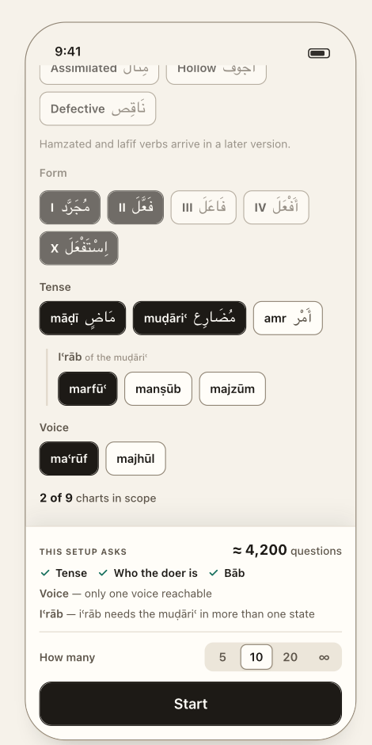
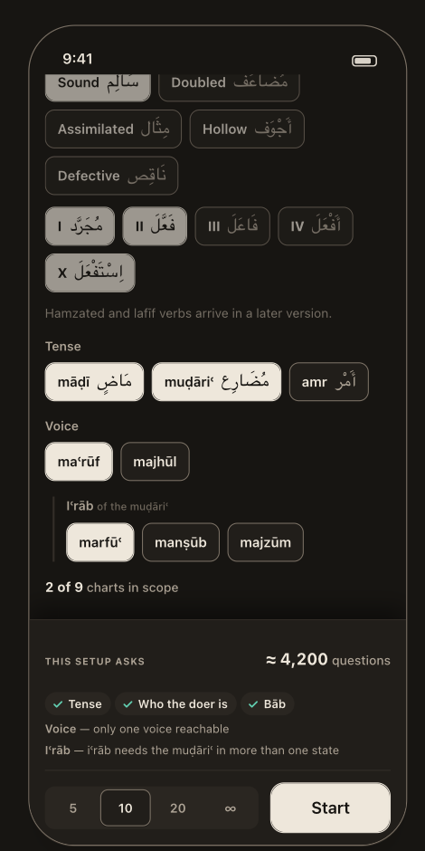

# Practice

> **Job:** describe a **pool of words**, see — before you tap Start — exactly what that pool will ask and how much of it there is, choose a length, go.
> **Tab:** Practice · **Design:** `guide/04-practice.md`, components *PracticeScreen · SetupBar · ChartScope · Chip*.
> **Rules for what gets asked:** [`reference/questions.md`](../reference/questions.md) § Relevance. **Content available:** [`reference/content.md`](../reference/content.md).

<table>
<tr>
<td align="center"> <b>09</b> · top of the screen</td>
<td align="center"> <b>10</b> · scrolled to the charts</td>
<td align="center"> <b>18</b> · Night</td>
</tr>
</table>

> 🔒 **D-69 · This is the Practice iOS builds** — **one scrolling screen with a pinned setup bar.** You chose the design's screen over both layouts the prototype has: the frozen one-screen *classic* (seven chip rows, consequences at the bottom) and the five-page *wizard* (type → verbs → charts → length → Ready page with a sample question). iOS ships **no `practiceFlow` setting**.
> **Kept:** the invariant that **the Practice UI never constructs a plan** (D-34), so any layout can be replaced later with no migration.
> **Dropped with the wizard** (♻️ D-42, all decided in Aug 2026): its **sample question** ("the feature", A2·Q2), its footer **delta line** (A2·Q3 — the design removed it on purpose), the Ready page's **Edit** button, and *always opens at step 1*. A sample-question preview could be added to this screen later as an addition, not a layout.

---

## Anatomy, top to bottom

| # | Section | Control | Notes |
|---|---|---|---|
| 1 | **Title** | serif screen title "Practice" | |
| 2 | **What kind of question** | four **cards**, two by two, single-select | Arabic term beside the English, one-line explanation each (D-35). |
| 3 | **Verb type** | chips, multi-select | Sound · Doubled · Assimilated · Hollow · Defective, each with its Arabic. Then one sentence: *"Hamzated and lafīf verbs arrive in a later version."* |
| 4 | **Form** | chips, multi-select | Numeral + **wazn** (`II فَعَّلَ`). **Same label, control and chips as the Tables screen's** — the second place a student picks a form. |
| 5 | **Tense** | chips, multi-select | māḍī · muḍāriʿ · amr, each with its Arabic. |
| 6 | **Iʿrāb** *of the muḍāriʿ* | chips, multi-select | Directly under Tense, indented behind a rule. marfūʿ · manṣūb · majzūm. |
| 7 | **Voice** | chips, multi-select | maʿrūf · majhūl. |
| 8 | **Chart count** | one line | **"2 of 9 charts in scope"** — nine being what exists. |
| 9 | **Setup bar** *(pinned)* | see below | Docked at the bottom, always visible. |

**Quiz-type cards** (verbatim; the **ids never change** — they are written into every stored answer):

| id | Name | Arabic | One line |
|---|---|---|---|
| `identify` | **Parse the word** | تَحْلِيل صَرْفِي | You see a word — name its form, tense, iʿrāb, voice and doer. |
| `produce` | **Write the word** | صِيَاغَة | You're given the grammar — type the Arabic. |
| `derived` | **Derived nouns** | المُشْتَقَّات | From a verb, pick its ism fāʿil, ism mafʿūl or maṣdar. |
| `fromMeaning` | **Match the meaning** | مِنَ المَعْنَى | You read an English meaning — choose the Arabic word that says it. |

🔒 **D-35** The type names are yours (recorded in `DECISIONS.md`); the design adopts them. صِيَاغَة, not كِتَابَة: writing is the physical act, *ṣiyāgha* is forming — which is what the user is doing.
🔒 **D-13** **One type per session.** Mixing is deliberately deferred so Results never averages two incomparable skills into one number.

---

## The setup bar — the consequences, pinned where you can see them

<table>
<tr>
<td></td>
<td valign="top">

Read top to bottom it is one sentence: **what you will be asked → how much of it there is → how many you want → go.**

1. **This setup asks** — label on the left, **`≈ 1,400 words`** on the same line. *(For `identify` the unit is now a **word**, because one word is one parse card — D-72. The other three types still count questions.)*
2. **Each word asks —** every **live** axis, ticked: `✓ Form  ✓ Tense  ✓ Who the doer can be`.
3. Every **retired** axis, **with its reason**, one line each:
   *Voice — only one voice reachable* · *Iʿrāb — iʿrāb needs the muḍāriʿ in more than one state*.
4. **How many** — a small labelled segmented control: `5 · 10 · 20 · ∞`.
5. **Start** — full width, primary.

</td>
</tr>
</table>

🎨 **D-38** — decisions inside the bar:

- **Everything in it is live.** Every tap above moves the count, the ticks and the reasons together.
- **Labels and reasons are the rule registry's own `label` and `reason`, printed verbatim.** The view cannot reword them, and a new question kind names itself here by existing.
  The reason is the part that matters: a struck-through kind says a question went away; *"iʿrāb needs the muḍāriʿ in more than one state"* says **which axis to widen to get it back.**
- **No delta line** ("↓ from 10,192 — no longer asking Voice"). An earlier draft had one; it is gone because the panel already shows the event happening — the kind leaves the ticked row and reappears as a reason. The *size* of the change is what is lost, and that is the cheaper half.
- **The length lives here, not in the body.** Everything above decides *what can be asked* and moves the count; the length decides *how many of those you want* and changes nothing about the pool. It is a **small control on a labelled row** (34pt) — a full-size segmented control beside Start read as a second action competing with it. **∞** is endless, which also keeps four values narrow enough to sit opposite the label.
- **Nothing live** → *"Nothing — widen the selection"*, and every kind prints its reason: the empty state is a list of instructions, not a dead end. Start is **disabled but keeps its shape**, so the bar does not resize when it becomes available.

**For `identify` the count is `≈ real cells in the pool`** — one parse card per cell (D-16, D-72). It is no longer multiplied by
the live kinds, because the kinds are no longer separate questions; they are rows of the one card, and the ticked list beside the
count is what says how many. The other three types still count `cells × live kinds`.
"Real" matters either way: cells the engine answers `null` for (the majhūl of an intransitive verb, the amr outside 2nd person)
are not counted — multiplying dimensions instead once claimed 798 questions where 266 meant anything.

⚠️ **The number on this screen drops by 4–5×** against the old spec, and that is arithmetic, not a loss: 4,200 was 1,400 cells ×
3 kinds. The same 1,400 words are still asked about in the same five ways. **Say *words*, not *questions*, so the drop reads as a
change of unit.**

<b>Measured 2026-09-21</b> — sound verbs, forms I · II · X, identify (the design's numbers, re-run against today's lexicon)

| Setup | ≈ words | *was, × kinds* | Live axes | Retired |
|---|---:|---:|---|---|
| **default:** māḍī + muḍāriʿ · maʿrūf · marfūʿ | **1,400** | *4,200* | Form, Tense, Who the doer can be | Iʿrāb, Voice |
| + majhūl | **2,548** | *10,192* | Form, Tense, **Voice**, Who the doer can be | Iʿrāb |
| drop māḍī | **700** | *1,400* | Form, Who the doer can be | Tense, Iʿrāb, Voice |
| muḍāriʿ only + all three moods | **2,100** | *6,300* | Form, **Iʿrāb**, Who the doer can be | Tense, Voice |
| amr only | **300** | *600* | Form, Who the doer can be | Tense, Iʿrāb, Voice |
| every tense, both voices, all moods | **5,396** | *26,980* | all five | — |

**Note what the Form axis does to D-17.** Form is live in *every* row above, because the mock's selection is forms I · II · X.
So a narrowed setup no longer collapses to a single hard question — the card keeps at least Form and Doer. Narrowing still makes
the quiz **harder, not shorter** (D-17), but the floor is higher than it was.

The corpus grows; regenerate rather than trust these — the recipe is the script in `web-prototype/`, run 2026-09-21.

---

## The axes — one control per axis, and a count that ties them together

🎨 **D-39** Tense, voice and iʿrāb are the axes of **the nine charts that exist** (`CHART_SHAPES`). An earlier draft was a two-axis grid; it was the wrong trade — *a grid has to be read as a grid before you can change one thing, and changing one thing is what people come to this screen to do.* So: **three labelled groups of chips and one line counting the charts they add up to.**

- **A single chart is not selectable.** A plan is tense × voice × iʿrāb; "māḍī majhūl plus muḍāriʿ maʿrūf" cannot be expressed and nothing here suggests it can. If per-chart selection is ever wanted, that is a plan-model change (a set of shapes instead of three arrays) — its own decision.
- **Iʿrāb belongs to the muḍāriʿ** (D-32). Its group sits under Tense, is labelled *"of the muḍāriʿ"*, and **without the muḍāriʿ becomes *"needs the muḍāriʿ"***. The mood selection is **kept**, so putting the muḍāriʿ back restores it.
  > ❓ **Q-06 · Disabled in place, or vanishing?** The design contradicts itself. `guide/04-practice.md` §2 says the group **vanishes** ("appearing and vanishing … is what makes the relationship readable"); the *ChartScope* README, its preview and `bundle.css` all say it **disables in place** ("a control that comes and goes moves everything below it"). Both files were regenerated in the same run.
  > **Spec assumes: disabled in place**, label reading *needs the muḍāriʿ* — three of four artifacts, including the reference implementation, and no layout shift under a tap target. Either way `guide/04` §2 needs correcting.
- **The amr's exception is stated** (D-39). The amr is one chart whatever the voice says. With **only the amr in scope the voice chips disable** and a hint says *"The amr has neither voice nor iʿrāb — it is one chart on its own."*
- **The count** — `N of 9 charts in scope` — is the read-out the grid's cells were.
- 🔒 **D-31** Practice describes a **pool of words, not a set of questions**: the same axes serve all four quiz types, choosing *which chart a word is drawn from* whether you will be asked to read it or write it.

## Verb type and Form — two questions, not one

🎨 **D-41** They were one "Verbs" section, a compound of two independent axes: *which kinds of verb* and *which forms of them*. Each gets a label.

- **Verb types use the terms a student is taught:** Sound سَالِم · Doubled مُضَاعَف · Assimilated مِثَال · Hollow أَجْوَف · Defective نَاقِص.
  **Two layers, deliberately:** the UI offers the group ("Hollow"); the plan stores the **engine types** (`ajwaf_waw` + `ajwaf_ya`). Expand **once, at the UI boundary** (D-33) — carrying a group name into plan data silently killed a Home drill.
- **Form chips lead with the numeral and follow with the wazn**, not the bāb's maṣdar name (shorter, and the wazn is how a form is recognised on sight): `I مُجَرَّد` · `II فَعَّلَ` · `III فَاعَلَ` · `IV أَفْعَلَ` · … · `X اِسْتَفْعَلَ`. Keep the maṣdar names (`بَابُ التَّفْعِيل`) for the Tables header, where there is room.
- **Do not advertise what v1 cannot play.** No mahmūz or lafīf chips — one sentence says they arrive later. A choice that does not exist in this version is a **sentence under the row, never a disabled chip** (a disabled chip means "exists but cannot apply").
- **Bāb is not a control** (D-18) — and since **D-76** it is not a question either. A root's Form I bāb is a lexical fact, so filtering by bāb would really be filtering the roots; and it cannot be read off a single conjugated word. It survives in the answer sheet's explanation.
- **What a quiz asks is not a control either** (D-15). The app decides from the pool; the user only shapes the pool.

> ❓ **Q-13 · Three small Practice gaps.** (a) **Empty selection.** The prototype's pool treats an empty **Form** or **Verb type** row as *"all"* but an empty **Tense** or **Voice** row as *"none"* — an unstated default masking absence, which your rules forbid.
> (b) **Which forms are offered** — the mock shows I–IV and X. (c) **Derived nouns** have no chart, so tense/voice/iʿrāb mean nothing for them.
> **Spec assumes:** (a) **an empty axis admits nothing** — count 0, *"Nothing — widen the selection"*, Start disabled, consistently for every axis; (b) the row offers **every form the engine conjugates: I–VIII and X** (IX is recognition-only, no charts); no per-verb-type disabling — the live count is what tells you a combination is thin;
> (c) choosing *Derived nouns* **hides the whole chart-scope block** (Tense · Iʿrāb · Voice · count), as both prototype layouts do.

## Defaults on first open

*identify · sound · forms I, II, X · māḍī + muḍāriʿ · marfūʿ · maʿrūf · length = the "default quiz length" setting (10)* — matching the design's mock. The draft **persists for the app session** and is **not** persisted across launches (prototype behaviour; nothing in the design says otherwise).

## Starting

1. If the type is **Write the word**, run the **Arabic keyboard check** first (`02-quiz.md`).
2. **`draft.plan()` — the single call that builds a plan** (D-34). Neither the chips nor any future wizard may construct one. That is what makes any layout deletable with no migration.
3. Build the session and present the quiz cover. Mode = **`custom`**, or **`endless`** when the length is ∞. The plan is stored **verbatim** with the session — it is what *Same setup again* and Home's hero replay.
4. A stored plan is **validated on the way back in** (`planFrom`): a verb type or form that no longer exists is **dropped, and the user is told** ("3 verb types from this session are no longer available") rather than quietly running a smaller quiz.

The old `alert("No questions possible")` is **unreachable by design**: Start is disabled whenever the count is zero.

---

## What is deliberately not on this screen

| Not here | Because |
|---|---|
| **Recent setups** | 🎨 D-40 The screen is for building a setup; a shelf of old ones competes with it. *Cost, said aloud:* with no "resume", changing one chip on session five means re-walking the screen — recents were the cheap answer. **Home** is where "what do I do now" lives, and a session's stored plan makes it a small addition later. |
| **Presets** | 🔒 D-37 The chips express any preset in two taps; Home carries the three presets. |
| **A chart picker** | D-39 — axes, not charts. |
| **A question-kind picker** | D-15 — relevance decides. |
| **A bāb picker** | D-18. |

## Mock-up caveats

- **Screenshots 09 and 10 show no tab bar.** Home and Tables do. The tab bar is the platform's and must stay; the setup bar docks **directly above it**. That costs vertical space — check the asks panel, the length row and Start on the **smallest supported phone** with all five kinds listed.
- The chip counts are real engine output for **Sound verbs, forms I, II, X**; the Verb-type and Form sections are fixed in the mock and only the three chart axes move the number. The Form row shows only I–IV and X (Q-13).
- Screenshot 09's `Voice —` and `Iʿrāb —` lines are the retired kinds; 10 shows the state after scrolling, where the setup bar has not moved.

## Acceptance

- [ ] The setup bar is visible at every scroll position and above the tab bar; Start is the only primary button.
- [ ] Tapping any chip updates the count, the ticks and the reasons **without blocking scrolling** (the pool walk conjugates every candidate cell — run it off the main actor).
- [ ] Reasons are the registry's strings verbatim; adding a question kind to the registry lists it here with no view change.
- [ ] Dropping the muḍāriʿ leaves the iʿrāb selection intact; adding it back restores it.
- [ ] amr-only disables both voice chips and states why; the chart count reads `1 of 9`.
- [ ] Zero live axes → "Nothing — widen the selection", every reason listed, Start disabled at unchanged size.
- [ ] The `identify` count reads **words**, and equals the pool's real cells — not cells × axes.
- [ ] **Form** appears in the ticked list whenever more than one form is selected, and retires with *only one form selected*.
- [ ] No **Bāb** row appears in the asks panel, live or retired.
- [ ] Choosing *Derived nouns* removes the chart scope; choosing another type restores it with its selection.
- [ ] The stored plan holds engine types (`ajwaf_waw`), never group names.
- [ ] No mahmūz / lafīf chip anywhere; the sentence appears once.
- [ ] Grep proves `draft.plan()` is the only call site that builds a plan on the start path.
