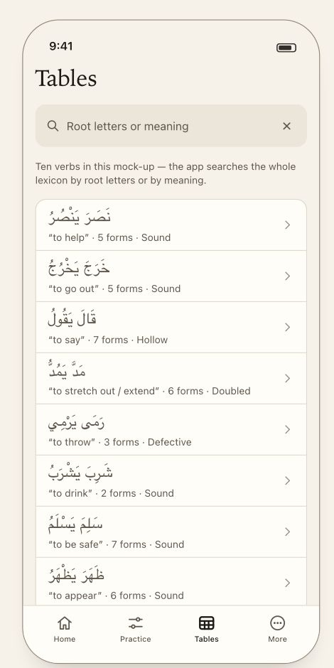
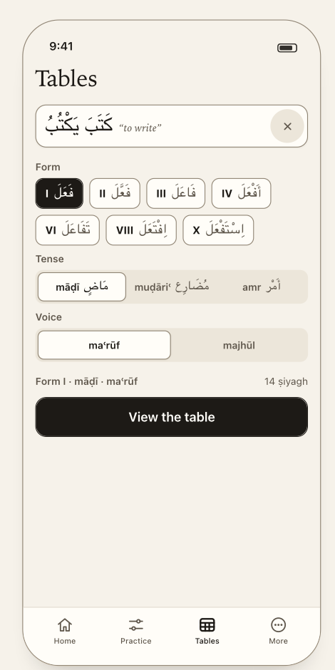
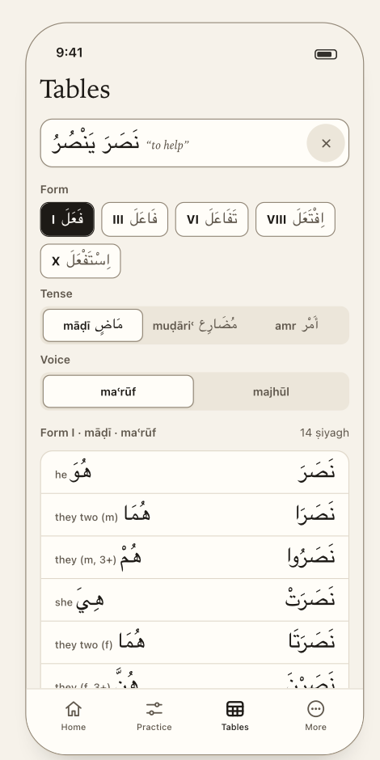
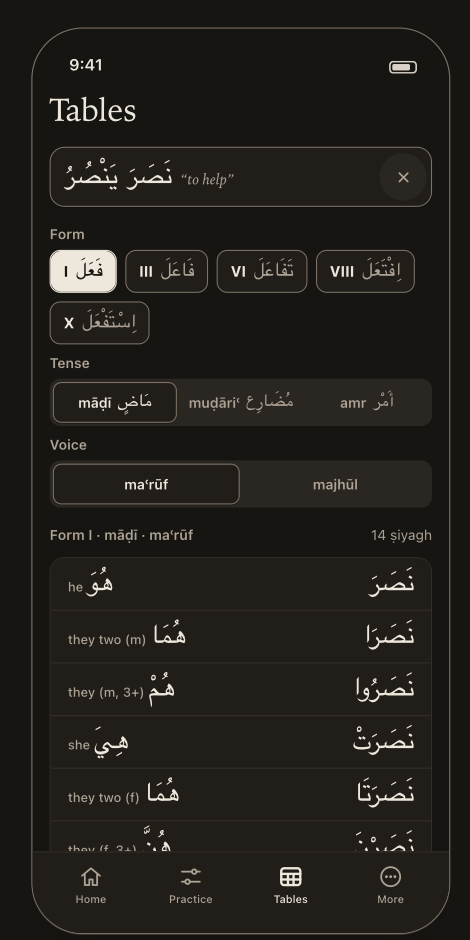

# Tables

> **Job:** find any verb and read its whole conjugation, offline — the app's best free feature. It showcases the engine and feeds the study loop.
> **Tab:** Tables · **Design:** `guide/05-tables.md`, components *TablesScreen · WordBar · Chip · ParadigmGrid*. Vocabulary: [`reference/domain-glossary.md`](../reference/domain-glossary.md).

<table>
<tr>
<td align="center"> <b>13</b> · searching</td>
<td align="center"> <b>11</b> · a verb chosen; table waiting</td>
<td align="center"> <b>12</b> · the table, after <i>View the table</i></td>
<td align="center"> <b>17</b> · Night</td>
</tr>
</table>

The screen reads top to bottom as a sentence — **this verb · this form · this chart · show it to me** — and each of those four is a different kind of control, chosen for what it has to hold.

## Anatomy

| # | Element | Control | Why this control |
|---|---|---|---|
| 1 | **Title** | serif "Tables" | |
| 2 | **Word bar** | one field, **two exclusive states** | *This verb.* |
| 3 | **Form** | **chips** — one per form the verb has | *This form.* Which forms a verb carries is a fact **about the verb**; the gaps are information. |
| 4 | **Tense · Voice · Iʿrāb** | **segmented controls** | *This chart.* Three members, always three, and comparing them is the point. |
| 5 | **The line** | `Form I · māḍī · maʿrūf` … `14 ṣiyagh` | Names the chart you are about to open. |
| 6 | **View the table** | primary button | *Show it to me.* |
| 7 | **The table** | 14 rows (6 for the amr) | Appears under the line, in the same scroll view. |

---

## 1. The word bar — one field, two states

🎨 **D-46** *Search until a verb is chosen; then the verb itself sits where the placeholder was — its citation and its meaning. The **X** is the only way back to searching.*
The states are **exclusive**: a search field that merely sat above the results would let the screen show one verb's chart while a search for another is open — two answers to "what am I looking at?".

| State | Shows | Tapping |
|---|---|---|
| **Verb chosen** | the **citation** (`نَصَرَ يَنْصُرُ`) and its gloss “to help”, then **✕** | the word or ✕ → search state |
| **Searching** | magnifier, placeholder **"Root letters or meaning"**, **✕** | ✕ → cancel: back to the chosen verb, **selection intact** |

- The citation in the bar is the citation of **the root *and the chosen form***: pick Form VIII of نصر and the bar reads `اِنْتَصَرَ يَنْتَصِرُ “to triumph”`. **One bar, one verb**; the form chips are what move between them, and the bar is where each form's meaning is read.
- Searching **replaces the pickers and the table**; cancelling restores them.
- **First open (nothing chosen yet):** the search state. The selection then **persists for the app session** (prototype behaviour).

### Search

🔒 **D-43** Matches **root letters and English gloss only** — *not* conjugated forms. Typing `يَنْصُرُونَ` will not find its chart. A reverse index over every generated word was **deferred, not rejected** (in case reading practice becomes a goal).

- Root letters match with or without spaces (`نصر`, `ن ص ر`); the gloss match runs over **every form's gloss**, case-insensitive substring — so "triumph" finds نصر through Form VIII.
- **Each result reads as a verb, not a string:** the Form I citation (first attested form's, when there is no Form I), its gloss, **how many forms it carries**, and its type — `قَالَ يَقُولُ · “to say” · 7 forms · Hollow`. Type is the group a student knows: Sound · Doubled · Assimilated · Hollow · Defective. Row = title + chevron.
- Tapping a result chooses the root, **selects Form I**, closes search. The table waits. **Five playable verbs have no Form I** (شرك، حمر، صلو، لبي، أدي — it is archaic or unattested): they open on their **first attested form**, and their result row shows *that* form's citation.
- An empty query lists every verb. No match → `Nothing matches "…"`.

> ❓ **Q-12 · What Tables searches, and in what order.** ⚠️ The prototype searches the **whole** lexicon, including the 30 mahmūz/lafīf roots that are flagged off — they then open onto *"no chart"*.
> **Spec assumes:** search covers **only playable verb types** (135 roots), the same rule as *do not advertise what v1 cannot play* (D-41); results in **Arabic alphabetical order by root** (nothing in the design says; the mock's order is arbitrary); the prototype's cap of eight results is **not** ported — it is a list.

## 2. Form — every form the verb has, on the screen

🎨 **D-46** Which forms a root carries is a fact about the verb, and one of the first things a student wants from a dictionary — so it is **not** a menu to open. **Every attested form is a chip, and the gaps are visible as gaps**: كَتَبَ has I, II, III, IV, VI, VIII, X — no V, VII or IX; رَمَى has three.

- Chip = **numeral + wazn** (`I فَعَلَ` · `II فَعَّلَ` · `X اِسْتَفْعَلَ`) — **the same control Practice uses for forms**, so the two screens agree.
  **Form I's wazn changes from root to root** (`فَعَلَ`, `فَعِلَ`) because it carries the bāb's vowels: free information, in the space a Roman numeral would have taken alone.
- What a menu could show and a chip cannot — each form's own citation and meaning — **moved to the bar**: tapping a chip puts that form's citation and gloss there (`نَصَرَ “to help”` → `اِنْتَصَرَ “to triumph”`). Reading the family is a row of taps.
- Chips wrap onto further lines; none are hidden.
- A form the verb **declares but the engine cannot chart** still shows its chip; selecting it says so rather than guessing. Today: **Form IX** (recognition-only; 2 roots) and **Form VIII of ضرب and دعو** (tāʾ assimilation not implemented — a recorded gap, `KNOWN_CONJUGATION_ERRORS`
  "Recorded decisions" § the engine declines rather than guess).

## 3. Tense, voice, iʿrāb — segmented

| Control | Options | Rule |
|---|---|---|
| **Tense** | māḍī مَاضٍ · muḍāriʿ مُضَارِع · amr أَمْر | always shown |
| **Voice** | maʿrūf · majhūl | **hidden for the amr**, with the hint *"The amr has neither voice nor iʿrāb."* |
| **Iʿrāb** | marfūʿ · manṣūb · majzūm | **only while muḍāriʿ is selected** |

**Gaps are shown as gaps** (🎨 D-46): خَرَجَ is intransitive, so it has no majhūl. The **majhūl segment is disabled** and a hint says *"خَرَجَ is intransitive — it has no majhūl."*
If majhūl was selected when you moved to a form/verb that lacks it, the selection **falls back to maʿrūf and the hint says why** — the screen **never silently swaps your selection for a chart that exists.** (This is the same rule that killed the prototype's second validator: one validator, and it **rejects rather than corrects**.)
If a chart truly does not exist for the selection: *"This verb has no chart for that selection."*, and the button is absent.

## 4. *View the table* — the table waits

🎨 **D-46** The pickers **do not redraw a chart as you tap.** The line names the chart you are about to open; the button opens it. **Changing any axis afterwards puts the table away and re-arms the button** — so what is on screen is always the chart that was asked for, never a half-changed selection.

- **What it costs, accepted:** a tap every time you compare two charts of the same verb. The alternative — a live table under the pickers — makes the button meaningless after its first press.
- **What is not paid here:** the prototype's *View table* was a navigation push, so changing one axis meant leaving the chart and coming back. Here the pickers never leave.
- Pressing it scrolls the table into view.

## 5. The table — fourteen rows, one per ṣīgha

🔒 **D-44** The chart is a **vertically scrollable list**, because that is the shape of the chart a student already owns and a list is what a long read wants. **All 14 rows** on a small phone by scrolling, not truncating. **No wazn column** — the wazn is still generated and still shown in quiz feedback; it is just not a column here.

- Row: **the pronoun** (small English + the Arabic pronoun) and **the word** at `arabic-title` size. Order = classic sarf order: 3rd (he, they two m, they m, she, they two f, they f) → 2nd (six) → 1st (I, we).
- **The amr has six** (2nd person only). The count on the line is derived — **never a fixed "14"**.
- Never wrap an Arabic word onto a second line.
- The **three-column paradigm grid is not deleted** — it is the *quiz's* peek (D-45): a glance mid-question wants the whole chart at once with its neighbours visible; a browse wants one row per ṣīgha and room to scroll. Same `fullTable()` underneath, **two shapes**, a second view and no model change. At the largest text sizes the peek falls back to this list.

## What neither shape can do yet

**Colouring the affixes** — the thing that turns a chart into a lesson, and the reason the grid's columns exist — needs the engine to return prefix / stem / suffix. Nothing produces that today. D-61: **documented, not built.**
It must be on the engine's export list **before the API freezes** (B3, the corpus freeze — `docs/TECHNICAL_PLAN.md` Part C), like `waznRoot()`.

## Not in v1 here

- **Compare** (two charts side by side) — dev-only, D-06; button would sit beside *View the table*. See `later-versions.md`.
- **Arriving from a question.** Quiz → *Full table* is the peek (D-45); **nothing deep-links into Tables in v1**, so the prototype's row-highlight is not needed. Results → *See the table*: Q-07.

## Data

**Reads:** the lexicon (playable roots), `citation(root, form)`, each form's gloss and wazn, `fullTable(spec)`, hasMajhūl. **Writes:** nothing. The engine is offline; the screen needs no network.

## Mock-up caveats

- Screenshot 13 says *"Ten verbs in this mock-up — the app searches the whole lexicon…"* — the real list is 135 verbs (Q-12).
- Screenshot 11's chart line reads `14 ṣiyagh` — correct for māḍī, **wrong for the amr (6)**.
- Screenshot 12 is scrolled: the pickers are above the fold and the table runs under the tab bar.
- These four screenshots **do** show the tab bar (Practice's do not).

## Acceptance

- [ ] First open lands in search; picking a verb selects Form I (its first attested form if it has none) and shows the table **waiting**, not drawn.
- [ ] Every attested form of the verb is a chip, none menu-hidden; the bar's citation and gloss change with the chip.
- [ ] Changing tense, voice, iʿrāb, form or verb puts the table away and re-arms the button.
- [ ] amr → no voice or iʿrāb controls, six rows, line says `6 ṣiyagh`.
- [ ] An intransitive verb's majhūl is disabled with the stated reason; nothing is silently swapped.
- [ ] Search for "triumph" finds نصر; searching `يَنْصُرُونَ` finds nothing.
- [ ] mahmūz / lafīf roots never appear.
- [ ] Table rows are pronoun + word only; no Arabic word wraps; all 14 reachable on the smallest phone.
- [ ] Every Arabic run is isolated; the mixed `Form I · māḍī` line does not reorder.
