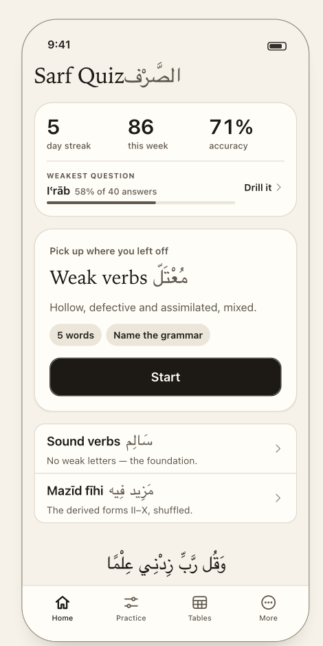

# More

> **Job:** the few settings the app has, the way out of the data it keeps, and the legal rows a store requires.
> **Tab:** More · **Design:** ❌ **none.** The design system draws four tabs but not this one. Its only hint is that the generic row (*title, optional Arabic, one line of description, chevron — "the generic row used here and in More"*) is **an inset-grouped `List`**.
> Everything below is derived from the prototype's `more.js` and your decisions, and **needs a design pass** (❓ **Q-09**).

<table>
<tr>
<td align="center"> the row style to reuse — Home's list</td>
<td valign="top">

**No screenshot exists for this screen.** The tab bar's fourth item (`ellipsis.circle`, label **More**) is visible in screenshots 01, 11, 12, 13, 15, 17.

**Spec assumes** an inset-grouped list, **sentence-case section labels** (the design bans tracked capitals), one row per setting:
title on the left, current value or a one-line description beneath, chevron or control on the right.

</td>
</tr>
</table>

## Rows

| Section | Row | Control | Notes |
|---|---|---|---|
| **Study** | **Appearance** | System · Paper · Night | Default **System**. The app follows the system appearance; Paper = `midad`, Night = `midad-night` (D-58). |
| | **Default quiz length** | 5 · 10 · 20 · ∞ | Default **10**. Seeds Practice's length control; a choice made in Practice is per-session and does not write back. |
| | **Arabic text size** | *see Q-15* | Prototype default `large`, currently a read-only row. |
| **Your data** | **Delete my history** | destructive row | Subtitle: **"N answers stored on this device"**, or **"Nothing stored yet"**. |
| **About** | **Privacy policy** | link | Required by the App Store. |
| | **Licences** | link | The bundled fonts are **SIL OFL** — the licence text has to ship with them (D-59). |
| | **Version** | value | |

**Not in v1, so not shown** (principle: never advertise what is off):

- **Detailed stats** — the prototype shows a *"SOON"* row here. With `detailedStats` off the row **does not exist**. When the flag turns on it returns under a **Progress** section.
- **Subscription, Restore purchases, Manage subscription, Terms of Use** — arrive with monetization (`later-versions.md`).
- **Practice layout** — the prototype's `practiceFlow` toggle. Gone (D-69): there is one Practice screen.
- **The developer levers** — `audience: 'dev'` rows are **not rendered in Settings** (D-03). A debug-only screen lists them, so a feature can be turned on for a look without an edit-and-reload.

## Delete my history

🔒 **D-53** *We keep every answer for every user, so we owe them a way to be rid of it.* Storing a complete behavioural record and offering no way out is not defensible.

1. Tap → confirmation showing **the count** — *"Delete all 2,341 stored answers? This cannot be undone."* — with a destructive **Delete** and **Cancel** (an alert is state in SwiftUI).
2. Confirmed → **all sessions and answers are removed.** Home returns to *"No drills yet"*.
3. **No export** at launch: history can be deleted, not extracted.
4. With nothing stored the row is inert (subtitle says so).

Deletion is **local**: nothing is synced in v1 (D-52), so there is no remote copy to reach. Settings themselves are **not** cleared by it.

## Settings mechanics

- One `Settings` object, one read path, **audience declared on each entry** (D-03): *user* rows are what this screen renders; *dev* rows are levers. A read is audience-blind — `settings.compareCharts` is the same call either way.
- **`detailedStats` gates screens, never storage** — the history writer must not be able to read any flag (D-51).
- The two **content** flags (`mahmuzVerbs`, `lafifVerbs`) feed **`availableTypes()`** — "is this verb type playable" has **one owner**; they are not a second check beside it.
- Persisted on device (`UserDefaults`); only values that differ from the default need be stored, and an id no longer in the spec must not linger as a phantom setting.

## Acceptance

- [ ] Every row is generated from the settings spec's `user` entries; adding a user setting is one entry, not a screen edit.
- [ ] No "SOON", "coming later" or off-flag row is visible in a release build.
- [ ] Delete shows the true count before confirming, removes every session and answer, and Home returns to "No drills yet".
- [ ] Changing Appearance takes effect immediately, including while a quiz cover is up on return.
- [ ] Licence text for every bundled font is reachable from About.
